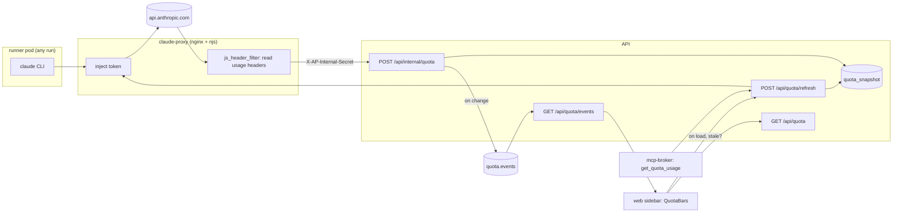

# 22 — Quota: the account's usage windows, always in view

Status: **shipped 2026-09-14** (helm `ap` rev 57 on pai; live-verified: pai answered `@pai what is our quota usage` with both windows and the >90% advisory, the proxy's internal POST answers 200, the sidebar shows 35% / 93% under the brand) — plan
at `docs/superpowers/plans/2026-09-14-quota-usage-bars.md`. Extends the
token-brokering proxy of [09](09-token-brokering.md), the tools block of
[12](12-executable-capabilities.md) and the participant-role tool trio of
[19](19-relay-agent-messenger.md)/[20](20-tickets-agent-work-tracker.md)/
[21](21-wiki-shared-knowledge.md).

One of the numbered design records under `docs/design/`. The series index is
`docs/design/00-overview.md`; component names are defined in
`docs/building-blocks/glossary.md`, and Kyle is the project owner.

## The ask (the PRD, in Kyle's words, 2026-09-14)

> 1. every response should update the value
> 2. we should cache the value somewhere including a timestamp of when the
>    value was last collected
> 3. a get_quota_usage tool should be introduced and made available to all
>    agents. It should do the absolute minimum query to anthropic needed
>    (from a token cost perspective) to get the usage response headers.
> 4. on the platform webpage page load, if the value is > the reset
>    timestamp, run get_quota_usage and async update it
> 5. make the bars look nice. Two bars, one blue, one kinda pink … with a x%
>    sorta in the middle (inverting the colour, so white on pink / pink on
>    white, for example), thin vertically, sidebar-spanning width, just below
>    "Agent Platform". I'll know blue is 5h and pink is weekly, no need to
>    label them. Use white for the rest of the bar so its like the top left
>    "Agent Platform" string just has two underlines

Acceptance criteria derived from it, referenced as **AC-n** below:

- **AC-1** Every response that api.anthropic.com returns to the platform
  (any runner pod, any run) updates the cached usage value.
- **AC-2** The cache holds the latest value of each window and the instant it
  was collected; it survives API restarts.
- **AC-3** A `get_quota_usage` tool exists, every agent holds it, and calling
  it makes the cheapest request to Anthropic that still returns the usage
  headers, then returns the fresh values.
- **AC-4** When the web app loads and the cached value is past its reset
  timestamp (or there is no value), it triggers a refresh asynchronously and
  the bars update when it lands.
- **AC-5** Two thin bars, blue (5-hour) and pink (7-day), the width of the
  sidebar, directly under the "Agent Platform" brand, unlabelled, white
  track, `NN%` centred in each with the colour inverted where the fill passes
  under the text.

## The problem

The Claude subscription that runs every agent has two rolling limits, a
five-hour window and a seven-day window. Anthropic reports both on every
API response as `anthropic-ratelimit-unified-*` headers, and Claude Code
shows them in its status line. The platform, which spends most of that
budget, shows nothing: Kyle learns the weekly window is at 81% from his
laptop terminal, and an agent that is about to schedule a heavy job has no
way to ask. When the window is exhausted, runs fail with an empty error and
the only trace is a `rate_limit_event` deep in a transcript (memory
`agent-platform-quota-failure-signature`).

Every one of those headers already passes through one pod the platform
owns: the claude-proxy, the nginx that injects the credential
([09](09-token-brokering.md)). It sees every response and drops the headers
on the floor.

## The decision in one paragraph

The claude-proxy keeps injecting the token and, on every upstream response,
reads the four unified usage headers and posts them to a new internal
endpoint on the API, authenticated with a shared secret it reads per request
like the token. The API stores one row, `quota_snapshot`, the latest value
of each window with its reset instant and the time it was observed, and
publishes a `quota.events` envelope whenever the value changes so the web
sidebar (over SSE) and anything else on Kafka can follow it. A
`get_quota_usage` tool, default-granted to every agent through the existing
participant-role grant list, asks the API to refresh: the API makes the
cheapest Claude call that still carries the headers, through the same
proxy, so the token stays where design 09 put it and the proxy observes that
response like any other. The sidebar renders the two windows as two thin
bars under the brand and, on load, asks for a refresh if the cached value is
older than its own reset.

## Naming

- **Quota** is the block name (Kyle's). The windows are the **5-hour
  window** and the **7-day window**; in prose "usage", never "rate limit"
  (a rate limit is what happens when a window is full).
- A **snapshot** is the cached row. An **observation** is one set of header
  values seen on one response; the snapshot is the latest observation.
- A **refresh** is the platform deliberately making a Claude call to
  observe. A **probe** is that call's request shape.
- The tool is `get_quota_usage` (Kyle's name; the other platform tools are
  verbs-as-nouns like `wiki`, but the ask pins this one). Its grant is
  `mcp__platform__get_quota_usage`.

## Architecture



Two paths write the snapshot and both end in the same store function:

1. **Passive** (AC-1): the proxy's header filter fires on every upstream
   response and posts the raw header values. This is the path that keeps
   the value current while pai is busy, at zero extra token cost.
2. **Active** (AC-3, AC-4): the API's refresh makes one probe call through
   the proxy. The proxy observes it like any other response (path 1), and
   the API also parses the headers off the response it holds, so the refresh
   returns fresh values synchronously even if the passive post lags.

## The proxy capture

`claude-proxy-config.yaml` grows a second njs function next to `auth`:
a `js_header_filter` handler on the `location /` that proxies to Anthropic.
It reads, from the upstream response, every `anthropic-ratelimit-unified-*`
header (the four the platform needs plus whatever else is present, so the
snapshot keeps the overage/grace/slow fields Claude Code also knows about
without a redeploy when they matter), builds a small JSON body, and issues a
fire-and-forget `ngx.fetch` `POST` to the API's `/api/internal/quota`
route (service `agent-platform-api`, port 8000), presenting the internal
secret in the `X-AP-Internal-Secret` header. The handler never awaits the fetch, never
modifies the response, and logs (not raises) on failure: a broken quota post
must never slow or fail a model call. Responses without the headers (4xx
from Anthropic without them, non-`/v1/` paths) post nothing.

The secret is read per request from `/secrets/internal/quota`, a new
`{{ .Release.Name }}-internal` Secret mounted read-only, exactly as the
token is read from `/secrets/claude/token` (rotation without restart). The
value is `.Values.env.AP_INTERNAL_SECRET`, required at install exactly like
`env.AP_SESSION_SECRET` (it lives in the stored values, never in git), and
the API reads the same value from its environment.

Network policy: `allow-api` gains `claude-proxy` as an ingress source on
8000, and `allow-claude-proxy` gains `api` (for the refresh probe). Nothing
else changes; the proxy's egress to Anthropic and its no-service-account
posture are untouched.

**Contract** (the body the proxy posts; the API tolerates extra keys):

```json
{"headers": {"anthropic-ratelimit-unified-5h-utilization": "0.22",
             "anthropic-ratelimit-unified-5h-reset": "1757880000",
             "anthropic-ratelimit-unified-7d-utilization": "0.81",
             "anthropic-ratelimit-unified-7d-reset": "1758150000",
             "anthropic-ratelimit-unified-status": "allowed"},
 "status": 200, "observed_at": "2026-09-14T15:02:11Z"}
```

Header values are forwarded verbatim as strings. Parsing lives in one
place (`quota.py`): utilization accepts a fraction (`0.22`) or a percent
(`22`, `22.5`), because the exact form was not observable from this machine
before implementation; reset accepts epoch seconds or ISO-8601. Live
verification records which form Anthropic actually sends.

### Alternatives considered — how the proxy reports

| Option | Pros | Cons | Verdict |
|---|---|---|---|
| njs `js_header_filter` + fire-and-forget `ngx.fetch` to the API | One place, per-response, no new pod, secret read like the token | njs networking from a filter has to be proven (the reference does not list handler restrictions for `ngx.fetch`) | **Rejected on evidence**: on njs 1.0.0 an `ngx.fetch` from the filter blanks the client's own response (empty reply), which is the one cost this design refuses to pay. Found by the docker test written to prove it |
| Shared dict + `js_periodic` push every few seconds | Networking from a timer handler is uncontroversial | Up to N seconds lag; more njs state | **Chosen** — the fallback shipped, same contract, same endpoint: the filter only writes to a shared dict, and a 5 s tick posts it |
| nginx access log with `$upstream_http_*` + tailer sidecar | Zero njs | A second container, log parsing, a file to rotate | Rejected |
| Proxy publishes straight to Kafka | Kyle likes Kafka | nginx cannot speak Kafka; a sidecar again | Rejected; the API publishes instead |
| API polls the proxy for a value it keeps | No secret needed on the proxy | Not "every response updates"; polling lag | Rejected |

### Alternatives considered — authenticating the proxy

| Option | Pros | Cons | Verdict |
|---|---|---|---|
| Static shared secret header, constant-time compare, uniform 401 | Matches the webhook secret's shape (`webhooksecrets.py`), no DB row, no per-run identity needed | One more secret to carry | **Chosen** |
| Per-run API key like runners | Existing mechanism | The proxy has no run and must never hold platform credentials beyond the token | Rejected |
| No auth, rely on network policy | Simplest | Any pod in the namespace could poison the snapshot | Rejected |

## Data model (platform Postgres, additive migration via `db.py`)

`quota_snapshot` — a singleton (`id = 1`, enforced by the store):

| column | type | notes |
|---|---|---|
| `id` | int PK | always 1 |
| `five_hour_utilization` | float, nullable | 0.0–1.0 |
| `five_hour_resets_at` | datetime(tz), nullable | |
| `seven_day_utilization` | float, nullable | 0.0–1.0 |
| `seven_day_resets_at` | datetime(tz), nullable | |
| `status` | str, nullable | the unified `status` header (`allowed`, …) |
| `raw` | JSON | every `anthropic-ratelimit-unified-*` header, verbatim |
| `observed_at` | datetime(tz) | when Anthropic answered |
| `source` | str | `proxy` or `refresh` |
| `updated_at` | datetime(tz) | row write time |

History is not a table: it is the `quota.events` topic (7-day retention),
one envelope per **change** of any utilization or reset value. A response
that repeats the values still bumps `observed_at` (AC-1) but publishes
nothing, so the topic reads as a burn-rate log rather than a request log.

### Alternatives considered — storage

| Option | Pros | Cons | Verdict |
|---|---|---|---|
| Singleton row + change events on Kafka | Trivial reads, history where the platform already keeps history, SSE via `TopicFeed` | Two writes per change | **Chosen** |
| Append-only `quota_observations` table | SQL history | Grows with every API call; needs pruning | Rejected |
| In-memory only in the API | No schema | Lost on restart (AC-2), not shared across replicas | Rejected |

## Events (Kafka, design-07 `Envelope`)

Topic `quota.events` (`TOPIC_QUOTA_EVENTS`, in `ALL_TOPICS` and in
`values.yaml` `topics.specs`, `retentionMs: "604800000"`), envelope type
`quota.event`, key `"quota"`, data = the snapshot as the API serialises it
(`five_hour: {utilization, resets_at}`, `seven_day: {…}`, `status`,
`observed_at`, `source`). `quota_feed()` is a `TopicFeed` over it with one
stream key, consumed by `GET /api/quota/events` exactly like the wiki feed.

## API (`/api/quota/*`)

| Route | Auth | Behaviour |
|---|---|---|
| `GET /api/quota` | `READ_ROLES` + `relay` | The snapshot plus `stale` (true when there is no row or `now` is past the earliest non-null `resets_at`) and `age_seconds`. 200 with nulls before the first observation. |
| `POST /api/quota/refresh` | `READ_ROLES` + `relay` | Runs the probe through the proxy, observes the response headers (`source="refresh"`), returns the same shape as GET. Coalesced: one in-flight probe per process; a caller arriving during one waits for its result. Short-circuits to the cache when it was observed under `QUOTA_REFRESH_MIN_SECONDS` (default 15) ago and is not stale, so a looping agent cannot turn the tool into a token drain. 503 with a plain `detail` when the proxy is unreachable or the response carries no usage headers. |
| `POST /api/internal/quota` | `X-AP-Internal-Secret` only (no session, no API key) | Observe. Uniform 401 on a missing or wrong secret, 503 when the API has no secret configured (fail closed). Accepts the proxy contract; ignores bodies without any known header. Never in the facade. |
| `GET /api/quota/events` | `READ_ROLES` + `relay` | SSE: `quota` frames with the GET shape, heartbeats, `overflow` marker. Excluded from the facade like every stream. |

The refresh's probe, in order, both through `AP_CLAUDE_PROXY_URL` with a
placeholder bearer (the proxy replaces it), `anthropic-version: 2023-06-01`
and `anthropic-beta: oauth-2025-04-20`:

1. `POST /v1/messages/count_tokens` with a one-character user message on the
   cheapest current model. No output tokens; if the response carries the
   utilization headers this is the whole probe.
2. Otherwise `POST /v1/messages` with `max_tokens: 1` and the same message.
   One input token-ish, one output token: the floor for a real completion.

The choice is made at runtime by looking for the header, so no config
follows Anthropic's behaviour around; live verification records which step
answered. The probe model is a setting (`QUOTA_PROBE_MODEL`, default
`claude-haiku-4-5`, the undated form the platform's model picker already
uses).

### Alternatives considered — where the refresh runs

| Option | Pros | Cons | Verdict |
|---|---|---|---|
| The API, through the proxy | Token stays in the proxy (design 09), one implementation for the tool and the web, coalescing in one place | The API needs egress to the proxy (one netpol line) | **Chosen** |
| The broker calls Anthropic itself | No API change | The broker would need the token; two refresh paths | Rejected |
| Runner pods report from their own responses | No proxy change | Every runner image changes; misses nothing the proxy does not already see | Rejected |

## The `get_quota_usage` tool (default-granted)

A plain `@mcp.tool` function in `broker.py`, `@_metered("quota")` like the
trio, no arguments. It `POST`s `/api/quota/refresh` with the caller's own
token and renders the answer as text a model reads well:

```
5-hour window: 22% used, resets in 3h 54m (2026-09-14 19:00 UTC).
7-day window: 81% used, resets in 3d 8h (2026-09-17 23:00 UTC).
Observed 2s ago (refresh). Status: allowed.
```

Above 90% on either window the text adds one sentence advising the agent to
defer heavy work until the reset. Errors come back as `error: …` strings.
The grant constant `TOOL_QUOTA = "mcp__platform__get_quota_usage"` joins
`PLATFORM_MCP_RELAY_TOOLS`, which already yields the `relay` per-run role
and the runner `--allowedTools` entry; `_ensure_quota_default_grant` sweeps
it onto every agent under a schema mark, the same helper the trio used.

## Web UI (the sidebar)

`packages/ui/src/quota.tsx` exports `QuotaBars({five_hour, seven_day,
observed_at, stale})`: two bars, each the sidebar's inner width, rendered
directly under `.nav-brand` through a new `SideNav` prop `belowBrand`
(the shared shell stays data-free; `services/web` fetches). Each bar:

- height ~12px so the centred `NN%` label (monospace, ~10px) fits; the
  track is white; the fill is `--ds-quota-5h` (blue) or `--ds-quota-7d`
  (pink), two new semantic tokens in `tokens.css` backed by two new
  primitives. No raw hex anywhere else (`check:tokens`).
- the label is drawn twice: once in the bar colour over the whole track,
  and once in white inside a layer clipped to the fill width. Where the fill
  passes under the text the letters read white-on-colour; elsewhere
  colour-on-white. No text is ever measured or split.
- `title` and `aria-label`: "5-hour window: 22% used, resets in 3h 54m ·
  observed 2m ago". `role="meter"` with `aria-valuenow`.
- stale (past reset, or older than an hour): the fill dims to 50% opacity
  until fresh data arrives. No value at all: the component renders nothing
  (no placeholder bars).
- light theme: the track uses the theme's raised surface token, since a
  white track on a white canvas is invisible; the fills stay the same hues.

`services/web/src/components/quota/useQuota.ts` follows `useTickets`'
shape: `GET /api/quota` on mount; if `stale`, `POST /api/quota/refresh`
(fire-and-forget, result merged into state); then `EventSource
/api/quota/events` with the same backoff/poll fallback; re-fetch on
`visibilitychange` to visible. `Layout.tsx` (where `SideNav` is rendered;
`App.tsx` only owns routes) passes `<QuotaBars {...quota}/>` to `SideNav`.
Rendered on every page (it is the shell). At ≤560px the nav does not
collapse: it reflows into a full-width horizontal bar (`app.css` `.layout`
column rule) with the brand on its own line, so the bars must stay directly
under the brand and span that full width there too; the 390-wide visual
review checks it.

### Alternatives considered — where the bars live

| Option | Pros | Cons | Verdict |
|---|---|---|---|
| Under the brand, inside `SideNav`, via a prop | Exactly the ask; one place for every page | `packages/ui` gains a component that takes data from the app | **Chosen** |
| A dashboard tile | Easy | Not "always in view"; the ask is explicit | Rejected (a tile can come later from the same hook) |
| Footer slot next to the theme toggle | Prop already exists | Not under the brand | Rejected |

## Identity, trust, and guards

- The proxy holds two secrets now (token, internal secret) and still no
  service account. The internal endpoint accepts nothing but the secret.
- The tool can only spend what the probe costs; `_metered` rate-limits per
  agent and the refresh short-circuit bounds the platform-wide rate to one
  probe per `QUOTA_REFRESH_MIN_SECONDS`.
- Snapshot values are numbers and a status string; `raw` is stored but
  never rendered into a prompt or a page without escaping. The tool's text
  is built from parsed numbers, never from header strings.
- Reader sessions can trigger a refresh from the web (AC-4 needs it);
  cost is bounded by the same short-circuit.

## File change list

Create:
- `services/backend/agentplatform/quota.py` (pure: header parsing,
  normalisation, staleness, text rendering)
- `services/backend/agentplatform/quota_store.py` (observe, latest, feed)
- `services/backend/agentplatform/api/quota.py`
- `services/backend/tests/test_quota.py`, `test_quota_store.py`,
  `test_quota_api.py`
- `services/mcp-broker/test_quota_tool.py`
- `services/claude-proxy/tests/test_proxy_quota.py` (docker-based, skips
  without docker) and a fixture fake upstream/receiver
- `charts/agent-platform/templates/internal-secret.yaml`
- `packages/ui/src/quota.tsx`, `quota.css`, `quota.stories.tsx`
- `services/web/src/components/quota/useQuota.ts`
- `services/web/tests/quota.spec.ts`
- `docs/building-blocks/quota.md`

Modify:
- `charts/agent-platform/templates/claude-proxy-config.yaml`,
  `claude-proxy.yaml`, `networkpolicy.yaml`, `api.yaml` (secret env),
  `values.yaml` (`env.AP_INTERNAL_SECRET`, `claudeProxy.quota`, topic spec)
- `services/backend/agentplatform/db.py` (model, default-grant sweep),
  `events.py` (topic), `settings.py`, `agentspec.py`, `api/app.py`
  (router, feed consumer), `api/schemas.py`
- `services/mcp-broker/broker.py`
- `services/mcp-facade/facade.py`, `test_facade.py` (counts 85/112)
- `packages/ui/src/sidenav.tsx`, `sidenav.css`, `tokens.css`, `index.ts`
- `services/web/src/Layout.tsx`, `tests/mock-api.ts`, `tests/a11y.spec.ts`
- `sdk/` (regenerated)
- `docs/design/00-overview.md`, `docs/design/09-token-brokering.md` (AS
  BUILT note), `docs/design/17-*` (facade counts),
  `docs/building-blocks/README.md`, `glossary.md`

## Task breakdown

The plan file carries the tasks with their acceptance checklists; the
dependency order is:

| Task | Requirement | Depends on | Parallel |
|---|---|---|---|
| T1 proxy capture + docker test + chart | AC-1 | — | with T2 |
| T2 model, pure library, store, topic | AC-2 | — | with T1 |
| T3 API routes, settings, facade, SDK | AC-1, AC-3, AC-4 | T2 | — |
| T4 broker tool + grant sweep | AC-3 | T3 | with T5 |
| T5 tokens, `QuotaBars`, `useQuota`, wiring `[ui]` | AC-4, AC-5 | T3 | with T4 |
| T6 docs | all | T1–T5 | — |
| T7 deploy + live verification | all | T6 | — |

## Not done (deliberately)

- No alerting when a window crosses a threshold: the health-monitor agent
  can call the tool and open an OPS ticket; that is a prompt change, not a
  design.
- No burn-rate chart: `quota.events` holds the data; a Reports page can
  read it later.
- No spend-limit window (`spend_limit` behind an apps gateway): pai is on a
  subscription; the parser keeps unknown headers in `raw` so nothing is
  lost.
- No per-agent attribution of usage: the headers are account-wide; the
  run-metrics rollups already attribute tokens per agent.

## AS BUILT

Deltas from the design above, each forced by a review, by a test, or by njs
itself (the ticked tasks in the plan record which):

- **The header filter cannot be the thing that posts.** `ngx.fetch` from
  inside `js_header_filter` blanks the client's own response on njs 1.0.0 —
  the run gets an empty reply from Anthropic, which is exactly the harm the
  design forbade. The fallback in the alternatives table is what shipped:
  `quotaCapture` writes the snapshot into a shared dict
  (`js_shared_dict_zone zone=quota:32k timeout=60s evict`) and
  `js_periodic claude.quotaPush interval=5s` posts it with
  `js_fetch_timeout 1500ms`. The capture is wrapped in `try`/`catch` end to
  end and the stored JSON is capped, because a dict that is full or a value
  that is oversize must log rather than throw into a response path. The
  "already sent" marker lives *in the dict* rather than in a module variable:
  a periodic tick gets a fresh VM, so a variable would forget what it sent and
  re-post the same reading forever. The cost is bounded and known: the
  snapshot lags a response by up to 5 s and a burst collapses to its newest
  reading, which is what the design allowed this fallback to cost.

- **The internal route reads the secret before it reads the body.** The body
  is parsed by hand instead of being declared as a pydantic parameter, because
  FastAPI validates a parameter *before* the handler runs — an anonymous
  caller would have had a megabyte of JSON parsed to earn a 422 describing an
  endpoint they cannot use. So: header compared first, then the body under a
  64 KiB cap, then anybody's schema. The OpenAPI body and the two 200 shapes
  are declared by hand for the same reason.

- **It never answers 204.** A report carrying no usage header is ignored, but
  answered with `{"ignored": true}` and a body, because njs's `ngx.fetch`
  never settles its promise on a bodyless 204 — the proxy would hang on the
  outcome it hits most often.

- **A timestamp from the future is clamped on the way in and healed on the way
  out.** `parse_observed_at` clamps a reported `observed_at` past our own
  clock (plus skew) to now; `quota_store._superseded` independently refuses to
  let a *stored* future timestamp win, so a row that got past an earlier check
  or a clock that jumped heals on the next observation rather than freezing
  the snapshot for good.

- **The singleton is written under a savepoint, in a loop.** Before the row
  exists there is nothing for `FOR UPDATE` to lock, so several first
  observations reach the insert at once. The loser's insert is scoped to a
  `begin_nested()` — `db.py`'s pattern for the same race — so only that
  statement rolls back, the caller's session survives, and the next trip round
  the loop finds the winner's row and updates it. Ordering is a guard, not an
  assumption: two proxy reports can cross on the wire, and the older one
  landing last would publish a drop in usage that never happened, so an
  observation older than the stored one is dropped (equal instants apply).

- **The refresh short-circuits inside the lock, not before it.** Both halves
  of the cache test are load-bearing — recency alone would keep serving a
  window that has already turned over, freshness alone would let a loop spend
  a probe per call — and doing the test under the same lock the probe holds
  means a caller arriving during a probe waits for it and then finds the fresh
  snapshot it wrote. Same answer, one fewer request to Anthropic. The probe
  asks any status: a 429 is exactly when these numbers matter most and it
  carries them.

- **`quota_probe_model` is `claude-haiku-4-5`**, the undated form the
  platform's model picker already uses, so the setting does not need editing
  the day a dated snapshot is retired.

- **The tool's text is the store's text.** `quota.render_text` builds the
  answer from parsed numbers and the reduced `status` token — no header string
  reaches a model — and the broker mirrors it character for character, so the
  sentence an agent reads is the same whichever side rendered it. A 503 from
  the refresh falls back to the cached reading and says how old it is, rather
  than telling an agent nothing is known.

- **The grant lands three ways, and the order matters.** `TOOL_QUOTA =
  "mcp__platform__get_quota_usage"` joins `PLATFORM_MCP_RELAY_TOOLS` (the
  participant role and the runner's `--allowedTools`),
  `_ensure_quota_default_grant` sweeps it onto every existing agent under a
  schema mark, and `DEFAULT_GRANTS` gives it to new ones behind
  `quota_default_grant`. The seeded wiki librarian is born holding it: review
  caught that its seed ran *after* the sweep had marked itself, so on a fresh
  install the one agent created by the build would never have been granted the
  tool at all.

- **The inverted label is one clipped overlay, not two measurements.** The
  label is drawn twice — once in the fill colour over the whole track, once in
  white inside `.quota-clip`, which carries both the fill and the white copy
  and is clipped to the fill width — so the letters can never disagree with
  the bar about where the boundary is. The clipped copy is positioned against
  the *bar* via a container query (`width: 100cqw`), which is the only way to
  hand a descendant the bar's width; against the clip's own width the two
  copies would not line up. The chip hues were deepened one step to
  `#2f6fe0` / `#c2379b`, because the label inverts across the fill edge and
  one ratio has to carry 4.5:1 in both layers.

- **Stale dims the whole bar.** Dimming the fill alone leaves a nearly-empty
  bar looking exactly like a fresh one — there is barely any fill to dim — so
  `.quota-bar[data-stale]` takes the track and the label with it.

- **SSE frames and refresh answers always replace; only catch-up reads are
  ordered.** A read can start before a refresh and land after it, and without
  the guard the bars would walk back to the stale numbers; ordering the
  *stream* the same way would let a clock skew wedge the hook, which review
  caught. A 60 s poll stands in when the stream is down, and
  `visibilitychange` re-reads.

- **Everything quota is gated on `claudeProxy.quota.enabled`.** The Secret,
  its mount, the proxy's push and the API's `AP_INTERNAL_SECRET` env are the
  two halves of one credential, so neither is configured without the other:
  `required` *inside* the gate rather than a default, since with capture on an
  empty value ships a sidebar that silently never updates, and with it off the
  API's internal route fails closed (503). `claudeProxy.upstream` is now a
  value and `proxy_ssl_*` follows its scheme — there is no combination that
  ships the token over https without checking the certificate — with `Host`
  and `proxy_ssl_name` derived from the same URL.

- **The facade is 85 default / 112 admin**, pinned by a test rather than
  counted by hand. `/api/quota/events` is excluded as a stream and
  `/api/internal/` as a prefix; `POST /api/quota/refresh` is curated out
  because agents reach it through the tool, where the per-agent metering is,
  and a raw route would be a second unmetered way to spend the probe.
  `GET /api/quota` stays a tool: reading the snapshot costs nothing.

Probe step that answered live: `message` — `count_tokens` returns no usage headers; the one-token `/v1/messages` call does.

Header value forms observed live: not captured (raw is not exposed by the API); both forms parse. R1: the push target must be the API service's full cluster name — nginx's resolver applies no search domains.
