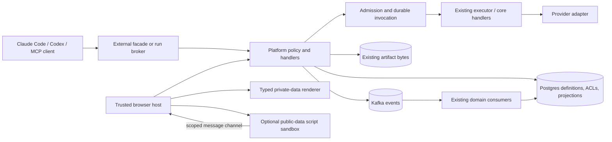

# 33 — Capabilities, plugins, and live apps

Status: revised design proposal, 2026-09-25. Supersedes the 2026-09-23 draft after independent OpenAI, Gemini and Claude reviews. This document authorizes no implementation or deployment. Current behavior below is grounded in repository source; live configuration still needs an implementation baseline.

## What this delivers

An agent owner can see what an agent can do, which accounts and data it can use, and which reusable working methods it knows. The same reviewed coding skills work in platform agents, local Claude Code and local Codex. A person can compose a live artifact page, bind it to platform Tools, publish a version, and use explicit actions without rebuilding a frontend image.

**Apps remain named collections** of live pages, static artifacts and actions. **Live pages may invoke general platform Tools**, including writes, sends, paid operations and agent invocation, when the operation is eligible, the viewer has the required grants, and the trusted platform UI obtains any required intent. The first pilot uses a small subset to prove this general contract; it does not limit the product to dashboards or read-only bindings.

The first proposed slice is `agent-platform-coding` plus a **Running Live App** over the existing Running projection, with an explicit **Report a running-app issue** Ticket action. It demonstrates owner-scoped reads, a real platform write, event refresh, a snapshot and MCP Resource access. Existing Apps stay operational.

Three implementation decisions narrow the first release:

- Private data is rendered by platform-owned typed components. Arbitrary author JavaScript may receive only explicitly public data. A sandbox protects the host but cannot make code trustworthy with a viewer's private bytes.
- Production plugin materialization accepts a skills-only subset, verifies retained release bytes, and rejects authority-bearing package features. General vendor plugin formats are more powerful than this subset.
- Principal/object authorization and cache changes precede new private Resource or live-page exposure. Feature rollback never restores the weaker access model.

These are recommendations of this revised design. The remaining product choice—whether unrestricted HTML/JavaScript authoring must ship in the first release—is explicitly open below. Choosing typed private pages does not remove general Tool actions.

## Vocabulary and ownership

| Product term | Meaning | Contract and execution owner |
|---|---|---|
| Tool | A callable function; multiplexed `action` branches are separately classified operations | API/core handler or reviewed executor adapter, exposed through MCP |
| Service Connector | Tools backed by an external provider/account | Reviewed adapter plus credential binding; a catalog category |
| Chat Identity | An external bot/account used to receive or send messages | Identity, secret references and destination policy; not itself a Tool |
| Connected chat transport | Discord/Slack inbound/outbound transport attached to an identity | Existing connector/Relay routing code |
| Platform Capability | Tools operating on platform state: Tickets, Wiki, Relay, artifacts, runs, agents, quota | Existing API policy plus operation grants; a catalog category |
| Domain Capability | A domain engine such as TTRPG | Domain service and Tool adapter |
| Image Generation | Product grouping for provider-backed generation and the Codex allowance path | Studio/API spending policy, provider adapters and artifacts |
| Resource | Addressable content with MIME, provenance and caller-scoped read access | Existing stores, exposed using MCP Resource methods |
| Skill | Reusable workflow instructions and references | Reviewed content; no additional authority in the platform's restricted package profile |
| Plugin | A versioned distributable package | Git source, retained release, host-specific adapters; not an MCP primitive |
| Live artifact / Live View | Versioned DB-defined page with a declared Tool policy | Trusted renderer or explicitly selected executable-content tier, plus API admission |
| App | Named navigation collection of views, artifacts and explicit actions | DB definition; independent of the domain service that supplies its data |

MCP distinguishes Tools, Resources and Prompts. A skill is a harness workflow, not automatically an MCP Prompt. An `ap://artifact/<id>` URI is read through authenticated MCP Resource methods; `/api/artifacts/<id>/content` is an authenticated browser route. The same stored bytes can back both. Catalog labels do not grant access or determine deployment topology. [MCP specification](https://modelcontextprotocol.io/specification/2026-07-28)

Keep existing MCP Tool names. `strava`, `linear`, `prices`, `stocks` and `index_movers` are service-connector entries. `discord_chat` and the Discord transport share an explicit Chat Identity eventually. `tcms` owns platform quality evidence. `ttrpg` remains a domain capability. `query_app` remains a compatibility gateway until named, bounded operations replace individual uses; views cannot select arbitrary URLs, SQL or internal paths.

## Repository baseline and scope

The reviews were written from supplied design material, not a live repository audit. In particular, the Claude review says it inspected a summary. Treat their findings as hypotheses to adjudicate, not equally authoritative implementation facts.

| Current evidence | Design consequence |
|---|---|
| `services/backend/agentplatform/api/auth.py` has password-backed `Principal` sessions, opaque `ap_` API keys and separate workload/run authentication | Extend the existing principal model; do not introduce an IdP or pretend existing keys have OAuth `iss`/`aud` claims. Human, external-client and run identities remain distinct. |
| `api/artifacts.py` checks agent Tool grants and human roles; ownership primarily controls deletion. It serves bytes with `private, max-age=31536000, immutable` | Object ACLs and HTTP cache policy need real changes before claiming private Resource isolation or prompt revocation. |
| `api/reports.py` sanitizes HTML, authorizes writers and uses broad role-based reads; dated reports can be replaced | Preserve script-free Reports. Immutable snapshot artifacts must capture a specific report revision rather than treating a mutable dated route as immutable. |
| `services/mcp-facade/facade.py` derives a curated Tool surface from OpenAPI, strips caller headers except Authorization, and forwards the opaque platform key to its own API | Preserve the cookie-smuggling fix and caller attribution. Add actual credential validation to new Resource/discovery paths; resolve the facade/API resource boundary before claiming OAuth conformance. |
| Broker and facade depend on `fastmcp>=3,<4`; the runner Dockerfiles pin Claude Code `2.1.214` and Codex `0.155.1` | Record resolved package/image versions and observed protocol behavior. Current web documentation is not proof of support in those images. |
| `runner._install_skills` copies directories into `~/.claude/skills` or `~/.agents/skills`, silently skipping unknown names | Replace silent omission with validated assignments, safe materialization and visible launch failure. |
| `joblauncher.py`, `readiness.py` and `skills.py` union skill-declared secrets into run bindings | Remove that implicit authority before assigning a plugin; changing only the runner copy function is insufficient. Audit actual DB assignments even though the source skill catalog is empty. |
| `apps/running/backend/runningapp/api.py` already provides summary, calendar, weekly, PR, brief and activity reads over its projection; `ingest.py` consumes agent-produced syncs | Compose a new owner-scoped view from reviewed structured adapters over the existing projection. Preserve the app's ingestion, calculations and coach path; passive page loads must not call Strava. |
| Apps contain services, Kafka consumers and domain rules, not just React pages | Move composition/presentation first. Preserve News freshness gates, market calculations, TCMS evidence ingestion and the TTRPG engine. |
| Helm already includes default-deny NetworkPolicies, SPIRE configuration and a `pg_dump` backup CronJob; HTTPS egress allowances are broad, backups are gzip on a PVC, and Kafka client traffic is configured PLAINTEXT | Verify existing controls and gaps. Do not claim provider-specific egress, encrypted backups, a KMS, or fully encrypted inter-service traffic already exists. |

No new database, bus or domain execution platform is proposed. An executable-view origin may require DNS/TLS/routing configuration. Private snapshots add data to the existing backup and deletion scope; backup protection must be documented rather than inferred from secret references. A general OAuth migration, organization-wide KMS deployment, new tracing backend, and complete network redesign are separate projects unless a concrete release gate requires them.

### Running pilot boundaries

Use synthetic fixtures in automated tests; live verification may use the owner's existing Running projection. Keep the pilot owner-only. Passive page loads read that projection rather than calling the external service. A new snapshot or Resource uses the same owner-scoped ACL and deletion behavior. Preserve the existing tool, job, projection, report and coaching paths during the UI pilot.

## Architecture and authorization



The API owns the invocation service. It reuses existing handlers and executor transport rather than creating a second tool execution stack or recursively calling the public MCP facade. For browser calls, the host sends session-authenticated requests with CSRF protection. The API resolves the human principal and supplies a verified invocation context to adapters. It never fabricates an agent token, shares an author's token, or gives the browser an executor credential.

### Operation catalog

Compile metadata from reviewed tool manifests and core operation declarations:

```text
operation_id, tool_name, action_discriminator, contract_version
input_schema, output_schema, category, provider, connection_kind
supported_principal_kinds, effects, output_classification, provenance
allowed_targets, view_eligible, limits, adapter_revision
```

`contract_version` covers behavior as well as JSON shape: units, ordering, filtering, identity and effect semantics. A compatible schema with changed meaning is not a compatible operation. Existing names remain aliases where necessary. Unknown action branches, unclassified outputs or unsupported caller types fail closed for new live-page admission; their legacy behavior changes only through a separate migration.

Effects are independent flags: `mutates_platform`, `external_send`, `incurs_cost`, `invokes_agent`, `reads_sensitive`. Record indirect effects too: ticket assignment or mentions can summon an agent; synchronizing a provider can write platform data. MCP read-only annotations and HTTP GET are descriptive, not security decisions. A reviewed handler enforces the catalog's constraints, so an author cannot declare a write to be a read.

The inventory must cover every current action branch. First-release **eligibility** can be limited to the pilot's operations while other entries say why they are unavailable. This avoids building human semantics for every Tool before delivering the primitive. Agent-private memory, secret administration, shell execution and unconstrained proxy/query operations are initially ineligible; being a general Tool bridge does not mean every privileged Tool must be exposed immediately.

### Principal and grant contract

Model authenticated humans, agent/runs, external API clients and service automation separately. Reuse existing Principal/API-key/run records, with an explicit kind and stable subject, rather than matching display names. Service automation is future scope; absence of a human session never falls back to it.

Admission requires **all** of:

1. Principal may open the App and exact published View version.
2. The version's alias permits the operation, arguments, target and trigger.
3. The principal has an explicit operation grant for this live-page surface.
4. Underlying object, project/channel, connection and Chat Identity ACLs permit the access/effect.
5. Data-access, rendering-tier, output, rate and spending limits permit this call.
6. Required host-created intent is valid and unconsumed.

The View manifest is an upper bound, not a grant. The author's authority is never inherited. Even an admin session does not give an embedded page unrestricted admin Tool access; direct administrative API behavior remains separately governed. Agent calls keep their frozen grant ceiling, intersected with current disable/revocation policy. API keys do not receive new operations from a role-based backfill.

A verified invocation context includes principal kind/id, authentication mechanism, actor component, view/version, operation contract, project/target scope, connection/identity, optional real run ID and audit/call ID. Adapter environment must preserve the minimal-secret rule. An operation that fundamentally needs an agent namespace must define and test a human meaning before becoming eligible; empty or invented `TOOL_CALLER_AGENT` is not a solution.

### Facade auth and protocol compatibility

The existing facade is a translator for the platform API's own opaque keys. The reviews correctly identify missing validation at its front door, but their assumption that these are third-party OAuth tokens is not established by source. MCP security guidance forbids accepting tokens issued for another resource and passing them downstream. Do not label the present gateway OAuth-compliant, or introduce an OAuth token-exchange system merely by analogy. [MCP security guidance](https://modelcontextprotocol.io/docs/draft/tutorials/security/security_best_practices)

Before new private Resource exposure, validate opaque keys through the authoritative API auth path for list/read/discovery as well as calls, preserve cookie/header stripping, apply revocation, and record the facade as actor through a trusted server path. Document whether facade and API form one protected platform resource and which credentials are intentionally valid at each entry point. Unknown credentials must not enumerate private metadata. If they become distinct OAuth resources, validate issuer/audience and use scoped downstream credentials or supported exchange; never forward a third-party provider token. The exact external-auth boundary is a Phase 0 decision, not a reason to weaken either domain.

MCP 2026-07-28 changes transport/discovery and cache contracts; it is not just a vocabulary update. Pin the SDK/protocol combination actually used in CI and test it with both exact runner versions. Inventory `server/discover`, routing headers, authorization, Resource errors/cache fields, subscriptions and legacy initialization requirements. Preserve a tested legacy path if pinned clients need it. Do not claim automatic down-negotiation, remove session support, or change replica assumptions until traces prove support. A whole-protocol upgrade can be a separate work package; Resource rollout must implement the contract of the protocol it actually advertises. [MCP 2026-07-28 changes](https://modelcontextprotocol.io/specification/2026-07-28/changelog)

## Data and Resources

### Classification, lineage and ACLs

Use two separate dimensions:

| Dimension | First-release values | Meaning |
|---|---|---|
| Confidentiality | `public`, `internal`, `confidential`, `restricted` | Which principals, renderers and caches may receive bytes |
| Provenance/trust | `platform`, `reviewed_external`, `untrusted_external`, `user_authored`, `model_generated` | How content was produced; public content can still be hostile |

Unknown classification defaults to restricted for new exposure. Credentials are never an eligible Tool result or Resource. Only **public** is eligible for arbitrary page scripts in the initial design; “internal” is not a synonym for harmless. Typed private views may read data only after object ACLs are enforced.

Derived snapshots, caches and results inherit the highest input confidentiality and restrictive object ACLs; record source lineage for attribution and deletion. Read access does not imply permission to publish. Explicit sharing/declassification must be separately granted and auditable. A label is insufficient: store concrete owner/recipient or project/channel ACLs. If a source disappears, distinguish immutable capture provenance from continued permission to serve the captured bytes.

Backfill artifacts and reports conservatively using verified ownership, run and project/channel provenance. Ambiguous legacy rows go on an admin remediation list; never infer that possession of a URL implies sharing. Run shadow comparisons against current access first, review intended losses, then enforce the new ACL on every list, detail, content, thumbnail, export and Resource path. Preserve intended portraits/shared assets through explicit grants. The backfill must widen no access silently.

### Resource contract and caches

Start with immutable artifact IDs and captured report snapshots: `ap://artifact/<id>` and `ap://view/<id>/snapshot/<snapshot-id>`. Add Wiki/version templates later when their ACL semantics are defined. Validate URI grammar, MIME and size; names, counts, error details and Resource listings must not reveal inaccessible objects. Use templates and pagination for unbounded IDs. Resolve bytes through the existing store, not a filesystem scan or arbitrary URL fetch.

Small text/Markdown and bounded image/blob resources are in scope. Oversized files return metadata and a separately authorized content route or explicit chunk/transform Tool, not megabytes of context. PDF extraction is a separate bounded adapter, not an implicit property of a binary Resource. Tool results may include a thumbnail for immediate inspection without duplicating the binary authority.

Server caches include principal, entitlement version, target scope, view/contract version, canonical arguments and source revision. Check current authorization **before** returning a hit. ACL-filtered MCP responses use private scope where supported; sensitive reads should have zero/short protocol TTL according to the pinned contract. Do not add unsupported fields to older protocol responses.

Replace the current one-year HTTP caching policy for revocable private content with `Cache-Control: private, no-store` initially; apply it to thumbnails, preview, snapshots and authenticated Resource HTTP routes too. Ensure Service Workers/CDNs do not retain private responses. Public immutable assets may keep long caching only when explicitly classified public. Changing a header cannot erase copies already downloaded or old cached responses: inventory legacy URLs, issue new revisioned content routes where needed, and state that historical bytes cannot be recalled. Revocation guarantees concern new authorized server deliveries, not a hostile/offline client's memory.

Static Reports retain sanitization and their existing script-free sandbox. Exported snapshots are immutable byte versions with capture time, source IDs/revisions, classification, lineage and ACL; retention or deletion can still tombstone and purge them. Reports may point to a newer snapshot without rewriting an old snapshot ID. Snapshot generation rechecks the caller, sources and intended audience. Raw client DOM capture is not an authority for private exports.

### Data protection scope

Before storing a new class of private snapshot, record actual database/PVC/backup protections, who can read them, retention/deletion behavior, recovery keys where encryption exists, and a restore procedure. The chart's gzip backup is not evidence of encryption. Do not repeat the former assertion of an unspecified “encrypted-secret mechanism”; provider secret bytes stay in existing controlled secret bindings, whose at-rest configuration must be verified separately.

Synthetic pilot fixtures do not require a new KMS or HSM. Before owner data is used, record and accept the actual storage/backup posture; material gaps become bounded prerequisites for that data class. Retention propagates through snapshot bytes and caches; backup restore must reapply deletion/revocation records before serving data. No compliance certification is implied.

## Live artifact authoring and runtime

### Rendering tiers and publication

| Tier | Author controls | Data admitted | Release decision |
|---|---|---|---|
| Typed View | Layout, text, chart/table/stat configuration, declared bindings and host-owned actions | Authorized public/private results | Recommended first private-data runtime |
| Scripted public View | Versioned HTML/CSS/JavaScript with the same declared Tool policy | Explicitly public results only | Optional first-release slice; not needed for pilot completion |
| Trusted executable View | Reviewed arbitrary code with explicit publisher trust | Sensitive data only under a separate approved trust model | Deferred; no “sandbox makes it safe” claim |
| Worker/remote-rendered extension | Constrained code emits allowlisted component operations | To be defined by a separate threat model | Research option, not an assumed security solution |

Typed definitions contain no JavaScript, `eval`, arbitrary HTML, unrestricted CSS/URLs, or expression language that can regain code execution. Begin with stat cards, tables, charts, text, filters and trusted action forms using existing UI tokens. Validate component props and links; private row values cannot become external image/link URLs. Novel widgets require reviewed platform code. This is the known expressiveness tradeoff; an editor can generate the same typed definition later.

Authors—including agents with draft permission—may save drafts. Publication is a separate grant and reviews version content, eligible operations, data flow, targets and budgets together. An agent cannot grant itself publish rights or enlarge its own operation policy. First release permits admin/human publication only; broader delegated publishing remains open. Revision of either layout or authority creates a new immutable version. Show requested permission changes prominently.

Draft preview uses synthetic fixtures and makes **zero live calls** by default. Marked live-preview reads use the author's real grants and identical limits. Testing a write still requires a host-owned action and receipt, identified as a draft test; draft mode does not bypass data-tier or target restrictions.

Illustrative typed definition; operation identifiers and schema are proposed, not existing endpoints:

```yaml
app: running
view: overview
renderer: typed/v1
title: Running
tools:
  summary:
    operation: running.summary.read@1
    trigger: load_or_refresh
    constraints: {owner_id: {principal: self}}
  report_issue:
    operation: tickets.create@1
    trigger: host_action
    constraints:
      channel_id: {const: owner_private_channel}
      assignee: {const: null}
    flow: user_entered_issue_only_no_activity_payload
    idempotency: required
layout:
  - component: stat_cards
    source: summary
  - component: action
    alias: report_issue
    label: Report a running-app issue
    form: running_issue_v1
limits:
  concurrent_calls: 2
  response_bytes: 262144
```

The proposed `running.summary.read@1` is a new operation over the existing Running projection, not a browser route to Strava or an assertion that the current app has per-user ownership columns. The first version is restricted to the single authorized owner and denies every other principal. Do not infer ownership from a query parameter or expose the old projection through a general Resource URI.

The first action omits agent assignment and escapes mention syntax so ticket creation does not accidentally summon an agent. It carries only text the owner enters; it must not silently copy activity names, routes, briefs or derived stats into a broader-audience Ticket. Its form is a trusted implementation with explicit field mapping. The handler still classifies actual indirect effects, and the general invocation API supports other Tools when they pass the same admission contract.

### Script isolation and bridge lifetime

For the optional scripted tier, use a dedicated non-credentialed origin and a sandboxed iframe without `allow-same-origin`, forms, popups or top navigation. Apply response-header CSP to the actual sandbox document: deny network, external assets and nested frames by default; serve only approved runtime/assets. A separate origin may reuse the web deployment with dedicated routing, but requires real host configuration. Avoid broad Domain cookies; verify direct sandbox navigation exposes no platform credentials. Existing Reports do not inherit this script policy.

**This is host containment, not private-data containment.** Authored code may self-navigate; `connect-src` does not cover every channel, and there is no dependable `navigate-to` control to close the gap. WebRTC and resource hints add attack surfaces. A dedicated origin, a reviewer signature or a successful finite test suite does not make arbitrary JavaScript safe to receive a viewer's private results. Reject such bindings before execution. [HTML iframe sandbox guidance](https://html.spec.whatwg.org/multipage/iframe-embed-object.html#attr-iframe-sandbox)

Bootstrap a per-document `MessageChannel` from the trusted host after checking frame source, nonce and exact bounded message schema. Opaque origins cannot be authenticated by comparing `event.origin` to the string `null`. Use the transferred port for data; do not keep broadcasting results with wildcard `postMessage`. On navigation/second load, disposal, version change or logout, close the port, invalidate pending delivery and require a new authorized setup. A nonce prevents cross-frame confusion, not malicious behavior by the page that possesses it.

`call_tool(alias, args)` means **request an operation from the host**. It does not call arbitrary MCP names or hold credentials. Aliases resolve only within the published policy. The server independently checks policy on every invocation; page-supplied flags such as `user_action=true`, classification or “confirmed” are never trusted. Scripts can request that the host open an action panel, but cannot synthesize trusted intent.

### Effects, information flow and durable calls

Read-only, unpriced operations can run on load or bounded refresh if classified accordingly. Writes, sends, spending or agent invocation require an action in trusted host chrome outside authored content. The host resolves the real operation, target identity/destination, effects, bounded argument summary and any price cap. The user's affirmative action authorizes those exact arguments. Future recurring automation requires a separate service identity, grants and budget; an open viewer session is not an automation credential.

Tool authorization alone does not prevent an author exporting what a viewer can read. Enforce data flow to **platform writes as well as external sends**: Tickets, Wiki, Relay, artifact titles and even search arguments/logs can expose content to a broader audience. For the typed tier, field sources and transformations are allowlisted and tracked by trusted code. The server derives lineage from source/result references, never client taint flags. Broader disclosure requires a separately allowed flow and truthful host UI. Arbitrary-script value tracking is not promised—such scripts receive only public inputs. Audit/call metadata visible to authors must not disclose viewers' private arguments or activity.

Before dispatch, the API creates a durable invocation record:

```text
admitted -> dispatched -> succeeded | failed | outcome_unknown
admitted -> denied_at_dispatch | expired | cancelled_before_dispatch
```

The record binds principal, App/View version, alias, operation contract, canonical arguments digest, target/connection, policy/entitlement revisions, intent ID, idempotency key, deadlines, budget reservation and trace/audit ID. Keep raw sensitive arguments out of general logs; any persisted payload needed for dispatch uses the protected invocation store with bounded retention.

Use validated JSON and RFC 8785-compatible canonicalization for digests, rejecting duplicate keys and non-finite values. Define string semantics explicitly: preserve exact Unicode strings unless a particular input contract specifies normalization, and display the same validated values being hashed. Do not silently normalize message content or paths. Same principal/view-version/operation/key plus the same digest returns the original receipt; the same key with different arguments returns conflict.

Consume short-lived intent and reserve the idempotency key atomically using DB constraints/transactions. Recheck current grants, target ACLs, disabled version/identity and remaining budget **at dispatch**, not just at admission. Two tabs cannot spend one intent twice. Revocation blocks admitted work that has not crossed the dispatch boundary; it cannot undo an already sent provider request. Record that boundary clearly. Core DB writes should commit the mutation and receipt consistently; external calls cannot share that transaction.

Use provider idempotency keys where supported. A timeout after dispatch, or a crash between provider success and receipt persistence, can leave `outcome_unknown`. The browser retrieves the receipt; it does not issue a fresh effectful request. Reconcile via provider status/operation ID when possible. Never claim exactly-once external delivery or blindly retry a potentially successful send. An explicit retry after an unresolved outcome requires a new user decision warning of possible duplication. Distinguish cancellation before dispatch from a browser closing after dispatch.

Bound concurrency, input/output bytes, wall time, per-principal and per-view call rates, provider/account-wide quotas and paid reservations. Reuse the image-generation reservation policy if that Tool is later admitted; do not build a second spending ledger. Global account limits prevent many individually compliant viewers exhausting the same provider quota. A provider 429 is a visible bounded failure/backoff state, not an automatic write retry loop.

### Persistence, refresh and snapshots

Add normalized equivalents of App definitions/versions, Live Views/versions, alias policies, ACLs/grants, invocation/intent records and append-only publication audit. Published versions are immutable; an App points to a published version. Optimistic draft revisions prevent lost edits; publication validates references and changes the pointer atomically. Rollback selects a previously published version only if it still passes current security/revocation rules.

Public API sketch: draft/read/update/preview/publish/rollback; `POST intent`, `POST call`, `GET call/<id>`; snapshot capture; catalog/readiness and grants. Operation contracts are pinned; record deployed adapter revision without promising execution of arbitrary historical adapter code. Retained compatibility fixtures must pass for published contracts, or the view becomes explicitly incompatible. A kill switch disables one view, operation or identity without losing history.

Domain rows remain query truth. Kafka carries durable publication, invocation and invalidation events through existing infrastructure; events carry scoped IDs/revisions, not private result bodies. Use an outbox or equivalent durable event publication so a committed mutation cannot silently lose its notification. One platform SSE stream per tab, coalescing/debounce, authorized subscriptions and bounded reconnect reconciliation prevent event storms and missed-update staleness. Duplicate/out-of-order events are harmless. Do not require zero dropped UI notifications; require eventual re-read of the authorized source. Passive page loads make zero provider calls in the pilot.

Show last successful source timestamp, loading/empty/stale/denied/unavailable states and receipt status. A disabled source must not look like an empty successful result. Snapshots use trusted rendering and pinned source versions; creating or sharing one goes through the same access and disclosure policy.

## Skills and plugins: one source, three delivery surfaces

A skill teaches a repeatable practice, not another copy of the API catalog. Agent job instructions remain in agent definitions, required constraints remain server policy, and Tool argument help remains with Tools. Start with orientation, change-with-evidence, regression design and incident reproduction; evaluate whether they improve real coder/QA outcomes before adding more.

```text
plugins/agent-platform-coding/
  plugin.json                         # portable identity, if supported by target
  .claude-plugin/plugin.json          # generated Claude adapter
  .codex-plugin/plugin.json           # generated compatibility adapter
  skills/
    platform-orientation/SKILL.md
    platform-orientation/references/
    change-with-evidence/SKILL.md
    regression-design/SKILL.md
    incident-reproduction/SKILL.md
  fixtures/                           # build/evaluation inputs, not runtime hooks
```

Current OpenAI packaging supports a portable root manifest and a Codex compatibility layout; those are not interchangeable with a marketplace index. Claude uses its own manifest and component conventions. Both ecosystems can package more than skills, including MCP configuration and hooks. Generate and validate adapters from one source; test discovery, precedence, naming and updates in each supported host instead of assuming identical semantics. [OpenAI plugin packaging](https://developers.openai.com/plugins/build/plugins), [Claude plugin reference](https://code.claude.com/docs/en/plugins-reference)

`coder` receives orientation/change/regression; `qa` receives orientation/incident/regression, plus a distinct QA workflow only if evidence warrants it. A human install may expose all skills. Do not load a “QA extends coder” instruction hierarchy or duplicate shared prose. Detect namespaced collisions and record the actual exposed skill names in each harness.

### Restricted runtime package and provenance

Production accepts only declared `SKILL.md` files and bounded, referenced non-executable text/assets. Validate frontmatter against an allowlist; reject authority-affecting fields such as `allowed-tools`, platform `secrets`, and unrecognized host control fields. Reject runtime hooks, commands with tool preapproval, agents/subagent manifests, monitors, settings, MCP/LSP/app configuration, executables and `bin/` from the skills-only release. A documentation code fence is guidance, not an executable asset. Future helper code requires its own reviewed profile and Workbench policy.

Build a fresh minimal role-specific package rather than copying the source tree wholesale. Resolve paths within the release root; reject escaping symlinks, traversal, duplicate archive paths, unexpected files and oversized archives. A skill cannot pull an unassigned skill into the run through references. A richer **local** integration package, if later needed, is a separate explicit install with disclosed connection/permissions; it is not the object materialized in production.

Git is the canonical source; DB stores assignment, enabled subset, release digest and approval state. Retain exact bundle bytes and manifest in the existing artifact storage or a verified immutable release cache. Apply a dedicated package ACL/lifecycle: ordinary artifact deletion/GC must not delete a release referenced by an assignment, retained run or rollback target. Digest verification alone does not authenticate its producer: the release manifest records source commit, builder/workflow identity, bundle digest, validation results and approval/signature. Verify the approved signer/source/build policy at registration and launch. Use an existing suitable CI signing mechanism if available; choice of signing mechanism is an implementation gate, not a mandate to deploy a KMS.

The launcher resolves and freezes the digest/subset at scheduling, stages verified bytes before CLI start, and records final skill hashes on the run. Retries/resume use that frozen set; revoked releases stop new launches even if a previous assignment points to them. No per-run Internet clone, marketplace install or dependency resolution. Missing, corrupt, unapproved or revoked releases fail visibly instead of silently omitting a skill. Keep at least one tested prior safe release. Rollback does not restore forbidden hooks or implicit secret grants.

Remove the skill-secret union across launcher, readiness, registry/API/wizard and tests before first assignment. If live legacy skills still require a secret, migrate that dependency to an explicitly reviewed agent/tool grant or mark the assignment blocked; do not silently drop it. Package installation must produce no change in Tool grants, secret bindings, network access, execution profile or publication privileges. Required capability IDs may be readiness diagnostics, never automatic grants.

### Distribution and discovery proof

| Target | Delivery | Required evidence |
|---|---|---|
| Platform Claude Code `2.1.214` | Materialize only assigned skills into a minimal plugin for tested `--plugin-dir`, or an equally filtered direct skill folder if plugin loading fails compatibility tests | Exact image discovers expected skills only; namespacing, invocation, resume and rollback work |
| Platform Codex `0.155.1` | Materialize assigned skills into the runner's existing `~/.agents/skills` path | Exact image discovers expected skills only; no assumption that current marketplace features exist in the pin |
| Developer Claude Code | Generated marketplace/package metadata and documented user/project install/update | Record tested host version; fresh install, update and rollback find the expected package |
| Developer Codex | Generated Codex marketplace entry and compatible manifest; documented trusted-project or user install | Record tested host version; verify manifest precedence and discovered skill hashes |

The developer workflow needs a one-time install per host; the platform UI supplies release/version and copyable instructions. It never silently edits a developer home directory. A diagnostic command maintained outside the restricted runtime bundle reports CLI version, package digest, visible skills and missing MCP connection without secrets. Local credentials belong to the local host's normal connection setup. Internal runner MCP configuration remains platform-controlled.

**Workspace discovery is a separate attack surface.** A clean home directory does not stop a harness scanning `.claude/skills`, `.agents/skills`, ancestor directories, project plugin settings or account-synchronized packages. Test these roots in the exact binaries. Use supported managed settings/discovery isolation or a controlled launch workspace that preserves the real source checkout; do not silently alter tracked user files. Ordinary repository instructions remain untrusted working context and cannot widen broker authority. If the pin cannot prevent unapproved skill/hook loading, block claims of assignment isolation and make a narrow harness upgrade/isolation design a prerequisite. Do not invent a CLI flag from current docs.

Skill acceptance includes one positive task and one negative trigger case, expected tool behavior, a maintainer, bounded instructions and no copied secret/API dump. Compare baseline and plugin-enabled coder/QA runs on disposable Tickets: discovery, successful completion, meaningful evidence, unnecessary turns, quota and spurious calls. Run deterministic discovery tests first; reserve real model runs for a small final behavioral sample.

## Chat Identities and later migrations

Chat Identities remain a valid product concept but are not on the first pilot's critical path. Add identity rows, secret-reference bindings and destination policy when multi-account send-as is needed. One identity can reference token, signing secret and refresh material; secret bytes never enter catalog metadata. Bind inbound receiving identity and external author; bind outbound actor, selected identity and immutable destination ID. Rotating credentials does not change identity.

The first additive migration now seeds `discord-default` with a reference to
the existing `discord-bot` credential, backfills Discord Relay bindings, and
includes identity attribution in the bridge's ingress/egress metadata. The
status field now pauses the connector's inbound and outbound traffic, the
notification API, and the legacy `discord_chat` Tool at the broker. Bindings
remain in place and resume with the identity. This is a runtime pause, not
credential revocation: the Discord token still exists in the Secret, and an
already dispatched provider request cannot be undone. The current transport
still has one account; multi-account send-as needs the per-identity credential
and destination checks below.

Migrate the existing Discord bot as a default identity with unchanged routes. Replay current route resolution before replacing first-name matching, surface ambiguities, and deny unresolved destinations. Test inbound/outbound parity, rotation, revocation and attribution using a disposable channel. Maintain an identity/route rollback map; revocation and historical audit survive rollback.

Later App migration is domain-by-domain, not an automatic cleanup phase:

| Domain | Keep | Gate before replacing presentation |
|---|---|---|
| TCMS | Real result ingestion, case reconciliation, schema and evidence provenance | Future view must preserve case/status parity; existing TCMS frontend can coexist |
| News | Ingestion, freshness rejection, deduplication and outbound publishing | Replay representative accepted/rejected events; archive and freshness parity |
| Stockmarket | Provider loaders and deterministic calculations | Units, timestamps and formula parity |
| Running | Existing ingestion, coaching, statistics and report publishing | Pilot view parity, owner-only access and bounded retention |
| TTRPG | Game engine, state machine and specialized controls | Demonstrate equivalent interaction/latency; a specialized hosted UI may remain permanently |

MCP Apps is a later export adapter, not the first-party runtime. Pin the extension revision and test a capable host, `ui://` resource linkage, app-visible Tool restrictions and useful non-UI results. Its web host sandbox architecture includes a separate-origin intermediary; a lone first-party iframe must not be called conformant. Export only views whose data/intent policy the target host can enforce. App visibility metadata is not authorization; `structuredContent` is not guaranteed private from model context. Do not assume Codex CLI displays iframes. [MCP Apps overview](https://apps.extensions.modelcontextprotocol.io/api/documents/Overview.html)

## Delivery, migration and rollback

First-release scope ends when the coding package and Running vertical slice are verified. Chat Identity refactoring, unrestricted script authoring, migration of every other App, a visual drag-and-drop builder and MCP Apps export are separately sized follow-ups.

| Phase / packages | Deliverable and dependency | Exit evidence | Rollback |
|---|---|---|---|
| 0 — C1: contract inventory and decisions | Map current operations/effects, principal/auth paths, data/ACLs, actual SDK/image/browser versions, pilot baselines and current data/retention paths. Choose auth boundary, package signing and authoring scope. | Registry fixtures, explicit pilot operation list, baseline measurements, decisions/open owners; no production changes | Document-only |
| 1 — C2/R1: policy foundation | Compile catalog; introduce explicit live-operation grants, object ACLs, classification/lineage and private HTTP cache changes. Additive schema and shadow access comparisons first. | Generated allow/deny matrix, conservative backfill report, no secret/metadata leak; old binary/schema compatibility or documented rollback floor | Disable new features; retain ACL/cache protections and forward-fix data |
| 2 — P1/P2: coding package | Remove implicit skill authority; build retained verified package and filtered runner delivery; document local installs | Exact-image discovery and hostile-package/workspace tests, digest rollback, small coder/QA evaluation | Select prior safe release or disable assignment; never restore skill-secret union |
| 3 — R2/C3/V1: first live vertical slice | Private Resources and API-owned human invocation; typed versioned View, trusted action, receipts, scoped refresh and fixture/source editor. Depends on Phase 1; can be developed independently of plugin UX | Private Resource/image/Markdown round trips; read, denied viewer and ticket action; dispatch/replay/failure tests | Disable Resource registration/bridge, retain existing Apps and security state |
| 4 — A1: Running pilot | Structured adapter over the existing Running projection, owner-only reads, user-entered issue Ticket and owner-scoped snapshot; shadow then canary | End-to-end evidence, view parity and agreed capacity gates; no Strava requests on page load | Route/pointer to existing frontend within five minutes; preserve tickets/receipts already created |
| Follow-up — I1/V2/A2/M1 | Chat Identities, optional public scripted runtime/editor, individual domain migrations, MCP Apps export | Each has its own value, compatibility and security gate | Component-specific route/assignment/identity rollback |

Implementation packages are vertical slices, not a mandate for a reviewer and full suite per file. C3 is the human invocation adapter; V1 includes the minimal typed renderer, actions and durable receipts; V2 is optional executable-page support. This replaces the former eight-phase critical path.

### Expand/contract and cutover procedure

1. Capture code/image/schema versions, current grants/ACL traffic, artifact ownership ambiguity and existing frontend outputs. Establish a tested backup/restore checkpoint without putting credentials in evidence.
2. Add tables/columns and feature flags. Prove compatible readers before enabling writes; use optimistic/versioned changes and idempotent backfills. Do not remove old columns/routes yet.
3. Compare old/new authorization in shadow mode. Resolve intended sharing and false allows. Turn on enforcement **before** new private reads; no broad fallback on denial.
4. Shadow the new pilot read model against the existing Running projection. Compare activity counts, distance units, weekly totals, PRs, brief timestamps, ordering and empty/stale states. Rendering must not invent a workout or coaching result.
5. Canary with synthetic fixtures and authorized/denied pilot principals; then use the owner's existing projection after its protection posture is accepted. Run one scripted action/snapshot/revocation flow. Keep the legacy route available.
6. Make the new collection primary only after gates pass. Retain the prior frontend/API for at least one release and a minimum seven-day observation window, extending it when usage is too low to supply evidence. Delete compatibility code only after explicit retirement review.

Database and security rollback are not synonyms for UI rollback. A prior binary that bypasses new ACLs is below the rollback floor and must not be restored on exposed routes. Use flags, a safe compatibility patch or forward fix. Invocation receipts and external effects cannot be erased to “undo” an action; compensate through an explicit authorized operation. Chat destination migrations retain a mapping; retained package bytes remain available across code rollback.

### Acceptance matrix

| Area | Required proof |
|---|---|
| Authorization | Human A/B, agent A/B, external keys and disabled principals across App access, aliases, object/connection ACLs and effects. Every missing factor denies; no synthetic agent identity; revoked admitted work never reaches executor. |
| Resources/cache | Cross-principal list/detail/read/thumbnail/copied URL/cache tests; no leaked name/count. Revocation denies subsequent server delivery. Old one-year cache limitation is documented and new private paths use no-store. |
| Classification/flow | Mixed-source snapshot inherits restrictive labels/ACLs. Typed Ticket/Wiki/Relay writes to broader audiences are denied unless a permitted disclosure flow exists. |
| Typed renderer | Reject script/expression/HTML/URL injection and private-to-external URL bindings. Accessibility, keyboard use, mobile and empty/stale/denied/error states pass. |
| Optional scripts | Public-only admission; no private sentinel delivered. Probe self-navigation, second-load messaging, resource hints, WebRTC, images/CSS, forms, frames, popups, fetch and parent access in Chromium/Firefox/WebKit. Record residual public-data channels; do not assert the browser blocks all navigation. |
| Intent/idempotency | Concurrent two-tab replay produces one local dispatch. Key reuse with different digest conflicts; reordered equivalent JSON has the same digest. Forged gesture/intent, expired version and changed target are denied. |
| Failure boundaries | Kill after admission, at dispatch and after provider response. Receipts recover; uncertain external effects become `outcome_unknown`, never silently redispatched. Revoke while queued, rotate identity and delete a listed resource. |
| Plugin release | Byte tampering, unapproved signer/build, missing bundle, escaping archive paths and forbidden hooks/config/preapproval fail before CLI start. Only assigned skill hashes appear. Workspace/account discovery fixtures cannot inject extra runtime components. |
| Host/protocol | Exact Claude/Codex runner pins plus recorded developer versions; actual Resource/tool round trips, legacy/new protocol behavior and package update/rollback. No “latest passed” substitution. |
| Data migration | Backfill replay is idempotent; no silent audience widening; ambiguous rows reviewed. Restore retains private ACLs, package pins, deletion records and publication pointers. |
| Pilot | Publish → owner read → denied principal → trusted issue Ticket action → receipt → event refresh → owner-scoped snapshot → MCP read → revoke/deny. Legacy Running ingestion and coaching still work. |
| Operations | Kill switch denies new calls for one view/tool/identity; receipt correlation survives service restart. Scoped events reveal no private data; reconnect reconciles missed invalidations. |

Security thresholds are zero false allows, zero secret leakage and zero duplicate local dispatch for one idempotency key. Deterministic pilot fields must match the retained fixture corpus exactly; passive page loads make zero third-party calls. An already authorized provider request is outside the local exactly-once claim.

Proposed performance gates, to ratify after the Phase 0 baseline: p95 plugin preparation adds no more than two seconds; p95 pilot page/API latency stays within 1.25× baseline; error rate rises by no more than 0.5 percentage points over a representative canary; rollback completes within five minutes. Benchmark plugin staging without spending model tokens on every launch. Load starts at 10 concurrent views and expands to 100 only if representative of the desired NUC capacity; record CPU/RSS and request budgets before choosing a hard memory limit. Do not relax a failed threshold after seeing the result without recording a new decision.

### Evidence and quota discipline

Each phase leaves a concise evidence record with commit/image/protocol versions, fixture/test command, allow/deny counts, latency/call/spend measurements, live invocation IDs and rollback result. Link evidence to the work ticket and final release. Audit correlates principal, actor service, view/version, contract, target, decision, invocation and provider outcome; no raw bearer, prompt or secret payload. Reuse existing logs/metrics/Kafka before adding a tracing service. Alert/runbook coverage starts with disabled/revoked call attempts, integrity failure, budget rejection and unresolved external outcome.

Before implementation, estimate work packages × implementer/reviewer passes and publish the projected quota range; the design does not invent a dollar estimate without current usage. Use one implementer per coherent slice and one batched review per phase, with a focused security review for authorization/materialization/intent boundaries. Routine UI/docs/fixtures use a lower-cost suitable model when delegation is authorized. No automatic swarm or endless repair loop is specified here.

Check `/api/quota` before each phase. Below 20% weekly headroom, do not start another phase without an explicit budget decision. Developers run focused tests during editing; the coordinator runs the relevant integration/full suite once at phase closure. One scripted live verifier records evidence; model sessions do not spend hours polling. Record a resumable checkpoint on quota exhaustion. The first release is complete at Phase 4; later migrations require a separate value/cost decision.

## Remaining decisions

| Decision | Recommendation / current boundary | Must be settled by |
|---|---|---|
| First-release authoring expressiveness | Typed private pages first; optional public HTML/JS. If unrestricted HTML/JS over private data is required, treat that as a separate trusted-code product, not a sandbox tweak. | Owner before Phase 3 scope freeze |
| Publishing delegation | Agents draft; authorized humans publish initial versions. Define whether a second reviewer is required for broader data-sharing or new effects. | Owner/security contract in Phase 0 |
| Facade protected-resource boundary | Validate existing platform keys centrally, retain scoped caller identity and cookie stripping. Decide same-resource gateway versus separately credentialed OAuth endpoint before advertising the latter. | Phase 0 auth contract |
| Package provenance mechanism | Retained signed release manifest with approved CI/source identity; select tooling already compatible with repository CI and recovery. | Phase 2 entry |
| Running data access and retention | Limit new views and Resources to the owner; define snapshot retention and deletion before live rollout. | Phase 4 live-data gate |
| Storage/backup protection and retention | Document current controls and accepted data classes; fix concrete gaps before real confidential snapshots. No assumed KMS/encryption. | Phase 1/real-data pilot gate |
| Client/browser support and budgets | Record exact supported versions and measured NUC baseline; ratify performance/canary thresholds. | Phase 0 exit |

Apps as collections and general granted Tool actions are settled product requirements, not questions reopened by this review. Plugin source-of-truth is reviewed Git with DB assignment; a future prose editor must produce the same reviewable release, not create a competing production source.

## Review-to-decision changelog

| Finding and review | Decision in this revision |
|---|---|
| All: keep catalog categories distinct from MCP/security primitives; do not replace domain engines with pages | Retained vocabulary, Tool names and domain ownership; made first-release versus follow-up scope explicit. |
| OpenAI/Claude: private data in arbitrary JS remains exfiltratable; Gemini still suggests srcdoc/navigation suppression | Adopt typed private rendering and public-only scripted admission. Reject the claim that srcdoc, top-navigation suppression or a separate origin solves private-data exfiltration. |
| All: human invocation needs its own semantics; Claude: reauthorize at dispatch and extend flow checks to platform writes | Added explicit principal intersection, trusted human adapter, dispatch checks, atomic intent, canonical arguments and audience-aware Ticket/Wiki/Relay disclosure. |
| All: ACLs precede private Resources; OpenAI/Claude: revocation and caches | Added conservative backfill, shadow enforcement and monotonic protection. Repository inspection additionally found one-year artifact caching; new private routes must use no-store. |
| Claude/OpenAI: vendor plugins can carry authority; Claude: workspace skills bypass DB assignment | Added skills-only compiler/allowlist, forbidden-feature fixtures, all-source discovery tests and cross-layer removal of skill-secret union. |
| OpenAI: digests alone do not establish provenance; all: exact harness pins | Added signed/approved retained releases, safe archive extraction, GC protection, frozen run hashes and separate production/local host tests. |
| Claude: all facade forwarding is forbidden token passthrough | Accept the validation/audience risk; qualify the proposed fix using actual opaque same-platform keys. Require a documented resource boundary; defer RFC 8693/OAuth redesign unless that boundary calls for it. |
| All: current MCP revision differs from legacy; Gemini proposes immediate stateless conversion | Add a tested protocol/client matrix. Reject an unverified whole-stack protocol upgrade as a prerequisite for catalog/plugin work. |
| OpenAI: classification, network, key-management, backups and observability gaps | Add lineage and protection/evidence gates; document actual Helm controls. Separate concrete fixes from ungrounded KMS/TLS/tracing infrastructure expansion. |
| OpenAI/Claude: feature rollback must not undo ACLs; Claude: scope too large | Replace eight-phase critical path with foundation, plugin, vertical slice and a bounded Running pilot. Specify rollback floor, forward fixes and quota checkpoints. |
| Gemini: structuredContent keeps UI data outside model context; instantaneous rollback/zero lost notifications | Do not rely on those assertions. Require explicit host data visibility, measured rollback and durable invalidation with reconciliation. |

## Sources and implementation references

Research inputs: original supplied `33-capabilities-plugins-and-live-apps.md` (2026-09-23), `openai.md`, `gemini.md`, and `claude.pdf` in the supplied `deep-research/skill-rework` directory. The last file contains UTF-8 Markdown despite its extension. Findings are adjudicated above; review-specific citation tokens are not dependencies of this document.

Primary references used for pivotal checks: [MCP specification](https://modelcontextprotocol.io/specification/2026-07-28), [MCP change log](https://modelcontextprotocol.io/specification/2026-07-28/changelog), [MCP security guidance](https://modelcontextprotocol.io/docs/draft/tutorials/security/security_best_practices), [MCP Apps](https://apps.extensions.modelcontextprotocol.io/api/documents/Overview.html), [OpenAI plugin packaging](https://developers.openai.com/plugins/build/plugins), [Claude plugin reference](https://code.claude.com/docs/en/plugins-reference), [HTML iframe sandbox](https://html.spec.whatwg.org/multipage/iframe-embed-object.html#attr-iframe-sandbox). Vendor/protocol support remains version-gated; source links are not test evidence.

Repository anchors: `services/backend/agentplatform/{api/auth.py,api/artifacts.py,api/reports.py,joblauncher.py,readiness.py,skills.py,artifact_store.py}`, `services/mcp-facade/{facade.py,test_facade.py,requirements.txt}`, `services/mcp-broker/`, `services/runner/{runner.py,Dockerfile,Dockerfile.dev}`, `tools/tcms/{tool.yaml,run.py}`, `apps/tcms/backend/tcmsapp/`, `apps/running/backend/runningapp/brief.py`, `charts/agent-platform/{values.yaml,templates/networkpolicy.yaml,templates/pg-backup.yaml}`, and `docs/building-blocks/{tools,skills,apps,artifacts}.md`. Check current source and tests again when implementation begins.
