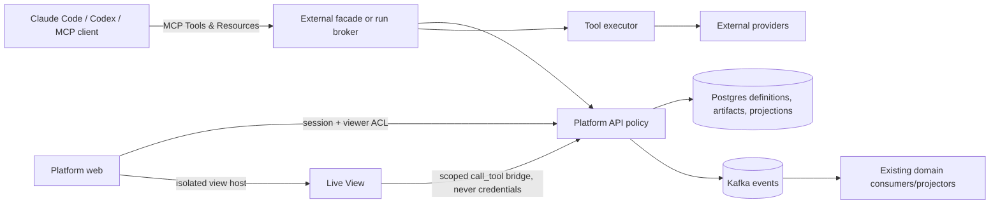

# 33 — Capabilities, plugins, and live apps

Status: design proposal, 2026-09-23. No implementation is implied by this document. It builds on the shipped broker, external MCP facade, artifacts, Reports, Relay, DB-first agents, Workbench, and Teams/Projects. The first pilot is `agent-platform-coding` plus a Running view that demonstrates both data loading and a deliberate Tool action; existing Apps remain operational until each has passed a migration gate.

## The experience this should create

An agent owner can answer four questions without knowing which service implements the answer: **What can this agent do? What data can it see? How does it talk outside the platform? What reusable working method does it know?** A person can create a polished, live Running app by choosing existing data bindings and a chart, publish a snapshot to Relay, and give a colleague an MCP resource URI for that snapshot. The same reviewed coding workflow can be assigned to `coder` and `qa`, and installed in local Claude Code or Codex without copying prose between four places.

The target is a clearer product model, not a rewrite of the execution substrate. Tools remain MCP-callable functions. Resources are addressable content. Skills are on-demand workflows. Plugins are distributable packages of skills and optional MCP configuration. Apps are user-facing collections of views and actions. A live view is a versioned, database-stored page running in a constrained platform host. Connectors and platform capabilities are **catalog categories**, not separate security systems or MCP primitive types.

The existing `/apps/news`, `/apps/stockmarket`, `/apps/running`, `/apps/ttrpg`, and `/apps/tcms` contain more than presentation: Kafka consumers, domain projections, external game hosting, and domain rules. A DB view cannot replace a news freshness gate or the TTRPG engine. The redesign moves **composition and presentation** into database state first; code that owns data and rules stays reviewed code until a specific replacement is proven. “No code-defined Apps” is the eventual authoring experience, not permission to execute arbitrary DB code.

## Vocabulary and ownership

| Noun in the UI | Meaning | Owner of the contract | MCP shape |
|---|---|---|---|
| Tool | One callable function with input/output schemas and effect classification | Broker/facade + API or tool executor | `tools/list`, `tools/call` |
| Connector | A Tool backed by an external system, or a transport adapter; UI always names the provider and account | Reviewed adapter code + credential binding | Usually one or more Tools; a transport may expose none |
| Image Generation | A product category grouping provider-backed image Tools and the Codex allowance path | Studio/API policy + provider adapters | Tools for generate/models; output is an Artifact Resource |
| Chat Identity | One external account/bot persona through which the platform may receive or send messages | Identity registry + secret bindings + Relay transport policy | May back chat Tools, but is **not** itself a Tool |
| Platform Capability | A Tool operating on platform-owned state: memory, Relay, Tickets, Wiki, Studio/artifacts, agents, runs, quota, etc. | Platform API and grants | Tools; related data may also be Resources |
| Resource | Addressable content to read as context, with MIME type and caller-scoped access | Artifact/Report/Wiki stores, exposed by MCP facade/broker | `resources/list`/`read` and templates |
| Skill | One repeatable workflow and optional references, without authority of its own | Reviewed package content | Harness skill; possibly MCP Prompt later |
| Plugin | Installable/versioned package of related skills and optional MCP setup | Git release + host-specific adapter | Host package, not an MCP primitive |
| Live View | Versioned HTML/CSS/JavaScript page with a declared Tool-call policy | DB definition; isolated page host and Tool bridge | Platform web UI; optionally MCP Apps `ui://` export |
| App | Named navigation collection of live views, snapshots, and explicit actions | DB definition | Web UI; discovery Tools/Resources |

**Terminology seam:** the existing `connectors.py` calls Discord and Slack conversation bridges “connectors,” while `discord_chat` is a custom Tool that posts through a bot. They are distinct implementations. In UI, show *Service connection* (Strava, Yahoo Finance, Linear), *Chat Identity* (a specific Discord bot), and *Connected chat transport* (Discord/Slack adapter). Do not mechanically rename Python classes or migrate auth as part of a label change. A “connector” remains a broad catalog grouping, with `kind=service|transport` behind the UI.

**MCP seam:** MCP’s [server primitives](https://modelcontextprotocol.io/specification/2026-07-28/server/index) call functions **Tools**, content **Resources**, and reusable client-invoked templates **Prompts**. Resources may contain text or base64 binary and are controlled by the client, so a host can decide whether and when to place them in context. A URL and an MCP Resource are different: an `ap://artifact/<id>` resource is read through authenticated `resources/read`; the existing `/api/artifacts/<id>/content` HTTP URL is for the browser. The external facade and in-cluster broker have different auth domains and must keep them.

### Current inventory, classified without breaking names

| Current surface | Target presentation | Decision |
|---|---|---|
| `strava`, `linear`, `prices`, `stocks`, `index_movers` | Service Connectors | Keep MCP names for compatibility. `prices`/`stocks` are two Yahoo-facing jobs today; consolidate only after measuring their distinct contracts. |
| `discord_chat` plus Discord bridge | Chat Identity + Connected chat transport | Bind both to an explicit identity; replace global “first channel by name” selection with stable destination IDs before multiple identities. |
| `image_gen` core Tool, internal executor tool, `codex-artist` | Image Generation | One policy and artifact result; providers remain selectable and auditable. Codex allowance is not an API-key connector. |
| `memory`, `tcms`, Relay, Tickets, Wiki, agent edit/grant, artifacts, runs, quota | Platform Capabilities | Keep effect-specific grants. A category is never authorization. `tcms` is platform-owned quality state unless/until it becomes external. |
| `ttrpg` | Domain capability | Game engine Tool, neither generic SaaS connector nor platform core; catalog needs a `domain` category. |
| `query_app` | Legacy domain query gateway | Keep until each domain has named read models/bindings; do not point a live view at an arbitrary path. |

Existing custom Tools are reviewed `tools/<name>/tool.yaml + run.py` executed by the isolated executor, whereas core broker Tools forward the agent’s per-run token to the API. The external OpenAPI-derived facade forwards an external caller’s bearer to the API. These deployment and identity boundaries remain because purpose labels do not provide isolation. The existing tool audit records caller, run, decision and argument digest; add effect and target identity to that envelope, not raw secrets or prompts.

## Architecture



The **catalog** records what a callable operation does: `category`, `provider`, `connection_id?`, `effects`, `data_classification`, `input_schema`, `output_schema`, and `view_eligible`. An operation ID is `(MCP tool name, action discriminator, schema version)` for multiplexed Tools, or `(MCP tool name, schema version)` otherwise. Effects are orthogonal flags such as `mutates_platform`, `external_send`, `incurs_cost`, `invokes_agent`, and `reads_sensitive`; one operation can carry several. Unknown action branches are denied to Live Views until classified. The existing MCP Tool name remains compatible. Presentation metadata can live in reviewed manifests for code Tools and in platform-owned definitions for core Tools; the catalog compiles them. Never infer safety solely from HTTP GET: `strava(action=sync)` reads Strava yet publishes platform data, and `image_gen` costs money. The catalog is a discovery/filter layer; the real API/broker grants and per-operation authorization remain authoritative.

**Chat identities** are first-class rows, e.g. `chat_identities(id, provider, label, external_account_id, lifecycle, version)` with `chat_identity_secret_bindings(identity_id, purpose, secret_block, required)` and `chat_identity_routes(identity_id, relay_binding_id, direction, policy)`. One identity can bind token, signing secret, webhook credential, and later OAuth refresh material without a credential value entering DB-visible metadata. Secret bytes continue in the platform’s existing encrypted-secret mechanism; stores and audit show references and verification state only. `send as` policy binds identity, destination, agent/team, and effect. An inbound connector authenticates the provider and records both external author and receiving identity; an outbound send records the actor/run and chosen identity. Rotating a secret need not change the identity or room. Existing Discord bot becomes a migrated default identity with identical behavior until a route is explicitly rebound.

**Resources** use stable, opaque URIs such as `ap://artifact/<id>`, `ap://report/<id>`, `ap://wiki/<page>?version=<n>`, and `ap://view/<id>/snapshot/<version>`. Start with artifact metadata and small text/Markdown/PDF/image reads; support resource templates for unbounded artifact IDs rather than listing every blob. Validate URI grammar, MIME, size, deletion, and caller access on *every* read. Never return private bytes from `resources/list` or expose names the caller cannot see. Bound text and base64 payloads; large files return metadata plus an authenticated content link or chunked/specialized Tool, because a multi-megabyte Resource can flood model context. Public `https://` is reserved for genuinely direct-fetchable content, never a disguised bearer-only platform URL. The same artifact may be both an MCP Resource and a browser attachment without duplicating bytes. An image Tool result may still include a thumbnail `ImageContent` for immediate model inspection.

Static HTML Reports remain sanitized and script-free. Treat an exported report as a **static snapshot resource** with provenance; the existing Report identity (`type/date/time`) can initially map to artifact metadata without deleting old report rows. Versioned Markdown, generated files and chart snapshots are artifacts with a `presentation`/`collection` link, not bespoke blob stores. The artifact store already separates metadata from bytes and emits `artifacts.events`; retain it as the binary authority. Resource listings use those rows and pagination, not a filesystem scan.

**MCP Apps is relevant but not the platform runtime.** The [MCP Apps extension](https://apps.extensions.modelcontextprotocol.io/api/documents/overview.html) describes a Tool linked by `_meta.ui.resourceUri` to a `ui://` HTML Resource, displayed by capable hosts in a sandboxed iframe; an App view may call app-visible Tools through the host. This is a good export target for selected Live Views. Host support varies, so the first-party web experience and text/structured Tool response must work independently. The platform can adapt a published view into a `ui://` resource and app-visible Tool calls, but only after matching the first-party permission contract. Do not assume Codex CLI renders an iframe. Capability negotiation and a browser smoke test gate export.

## Live Views and Apps

A Live View is an immutable published page version with a **Tool policy manifest**. It can call general platform Tools, including effectful ones, because the user explicitly wants live pages to be useful beyond passive dashboards. A page author declares the Tool operations it needs, the connection/Chat Identity if applicable, parameter constraints, trigger (`load`, `refresh`, or a named user action), call budget, and expected result schema. Publication reviews the page **and** its requested authority as one change. A viewer gets only the intersection of that published policy and their own entitlements; being allowed to open the page never silently grants every Tool the author had.

The working first authoring contract is **sandboxed HTML/CSS/JavaScript in the database**, accompanied by a declarative Tool policy manifest. This follows the requested markup-with-AJAX experience: an author can build a polished view without shipping a web image, while `call_tool(alias, arguments)` is the only platform RPC in the page. A template/widget editor may generate that same package later; it is not a separate execution system. The page runs in an iframe with an opaque origin (`sandbox="allow-scripts"`, never `allow-same-origin`), a restrictive CSP (`connect-src 'none'`, no external script/font/frame/form origins), no cookies, no parent DOM, no direct platform API access, and no provider secrets. Images/other assets enter as approved artifact bytes through the host bridge rather than credentialed URLs. The host injects only a tiny reviewed bridge script and a visual theme contract. Page HTML/JS can be imaginative; its Tool authority cannot exceed the published manifest and viewer. The server checks policy and viewer authorization **on every invocation**, not just at page load. Tools do not become safe because their MCP annotation says “read-only”; the platform’s own operation/effect catalog governs admission.

**Residual browser risk:** an opaque-origin iframe and `connect-src 'none'` do not, by themselves, prove that malicious authored JavaScript cannot navigate its own frame to an external URL carrying data. Browser support for navigation CSP controls is uneven. A scripted view receiving private Tool results is therefore **reviewed executable content**, not an untrusted safe document merely because it is sandboxed. Phase 0 must choose and prove one of two policies for the supported browsers: (a) a stronger reviewed isolation/runtime that prevents navigation and all other exfiltration paths, or (b) explicit publisher trust and viewer disclosure for sensitive results, with publication by an authorized reviewer. Until that proof, first-party scripted views may only receive non-sensitive/public data; private Running data can be shown through trusted platform widgets/read models even while the page shell is scripted. The security test must attempt `location` redirects, links, meta refresh, popups, image/CSS URL loads and redirects, not just `fetch`. This gate is allowed to change the first release's authoring format to typed widgets if scripts cannot meet the private-data goal on the target browsers.

Example definition (illustrative schema, not a promised endpoint):

```yaml
app: running
view: overview
title: Running Coach
tools:
  recent:
    operation: running.activities.read
    trigger: load
    args: {window: 7d}
    refresh: {mode: event, topic: app.running.activity.ingested, max_age_seconds: 300}
    limit: 50
  week:
    operation: running.weekly_summary.read
    trigger: load
    args: {weeks: 8}
    refresh: {mode: event, topic: app.running.summary.updated, max_age_seconds: 900}
    limit: 8
  sync:
    operation: strava[action=sync]
    trigger: user_action
    label: Sync recent runs
    args: {per_page: 30}
    idempotency: required
document: |
  <main>
    <h1>Your running</h1>
    <p id="distance"></p>
    <div id="runs"></div>
    <button id="sync">Sync recent runs</button>
  </main>
  <script>
    async function load() {
      const week = await call_tool('week', {weeks: 8});
      const recent = await call_tool('recent', {window: '7d'});
      document.querySelector('#distance').textContent =
        `${week.latest.distance_km} km this week`;
      document.querySelector('#runs').textContent =
        `${recent.activities.length} recent runs`;
    }
    document.querySelector('#sync').onclick = async () => {
      await call_tool('sync', {per_page: 30});
      await load();
    };
    load();
  </script>
```

The browser host invokes `/api/live-views/<id>/call` with a published version, declared operation alias, arguments, and a call ID. The API authenticates the **viewer**, checks the intersection of (1) App/View access, (2) published alias policy, (3) viewer operation grant, and (4) underlying data/connection/destination ACL, then validates arguments and cost. Publishing an alias cannot confer the author's rights on viewers. Existing custom-tool broker calls assume an agent/run identity; even though an API-key principal can reach some custom-tool paths, browser sessions do not have the same grant contract. The first implementation needs an **API-owned human invocation adapter** that reuses the reviewed executor/core handlers and audit/rate limits without inventing an agent token. Its invocation context records principal, view/version, team/project, approved connection, and optional run; operations whose semantics require an agent namespace (for example private agent memory) remain ineligible until their human semantics are defined. Phase 0 must introduce explicit operation grants for human principals and API keys rather than treating `admin` or a broad key role as a blanket Connector grant. Adapter-owned provider credentials are normal; a broader service publication grant is a separate, narrowly scoped, reviewed data-sharing object, never a generic fallback.

The page never holds an agent token, app key, connector secret, or direct access to the generic broker. Its `call_tool` request travels by `postMessage` to the trusted host. The host checks source window, per-instance nonce, exact message schema/size, and session CSRF; the API checks policy again on each request. The nonce prevents cross-frame confusion, but is **not** authorization by itself. The host alone renders Tool permission and confirmation UI outside the iframe. Per-viewer cache keys include identity/entitlements, version and arguments; never share private data through a public cache. A browser may use SSE/Kafka-derived invalidation, but calls remain bounded and do not poll a provider for every open tab. Explicit freshness/cost budgets protect quota-backed and paid Tools; image generation is **not** an automatic refresh call by default.

The bridge supports general Tool calls while making effects explicit. A call with no mutating, sending, paid or invocation effects may run on load or event-driven refresh. An effectful call requires a **host-owned action flow** or a separately approved automation policy. The trusted host displays the resolved operation, target and argument summary, collects the person's intent, and creates a short-lived single-use authorization bound to viewer, view version, operation ID and argument digest. Untrusted page JavaScript cannot assert `trigger=user_action` or synthesize a trusted click. Confirmation may be required for particularly sharp operations such as sending through a Chat Identity or spending image-generation allowance. To support autonomous widgets later, define a service-owned automation identity, explicit budget and audit, not a borrowed viewer session. A scripted page can also exfiltrate via the bridge itself by putting private read results into an approved `external_send` argument. Therefore the policy records output classification and permitted destination/payload flow; a page that can read sensitive data cannot send it externally unless a reviewer approves that exact connection/destination and bounded transfer. A UI confirmation alone does not sanitize the payload.

Every call uses a durable invocation record: `admitted → dispatched → succeeded|failed|outcome_unknown`. Persist admission **before** dispatch. The host creates an invocation key unique within `(viewer, view version)` and persists operation ID and normalized-argument digest beside it. Reusing a key with different operation/arguments is rejected; the same person may deliberately repeat an operation under a **new** key. Same-key duplicate requests dispatch at most once locally. On a browser or gateway timeout, the page looks up the existing receipt; it does not blindly retry an external send or image job. If a crash occurs after provider dispatch but before completion is recorded, the result may remain `outcome_unknown`; reconcile where provider APIs permit and show the risk that a new deliberate attempt may duplicate the external effect. Native provider idempotency is used when available. A failure is shown with operation ID and audit correlation, without dumping HTML errors or secrets into the page. Per-view/viewer concurrency, time, output bytes and spend limits apply server-side.

An **App** is a DB row with slug, description, icon, owner/team/project scope, navigation entries, and versioned ACL/publish state. It can contain Live Views, static snapshots, links to Relay channels and Tickets, and approved Tool actions. Existing `Apps` page becomes a DB-backed directory over time. For `Running`, keep the Strava Tool and activity/brief projector initially; replace the React viewer with a Live View that can browse runs and explicitly sync them. For `News`, preserve ingest, freshness rejection, archive and Discord posting. For `Stockmarket`, preserve price loading and deterministic calculations. `TTRPG` has a real game engine and control surface; it is a late migration candidate and may retain a specialized hosted UI. `TCMS` is a workflow backend and may expose an App for browsing, not become markup alone. No migration is considered complete merely because the first screen looks similar.

**Data products:** each surviving domain service must declare operation schemas and effects. Prefer named platform Tool adapters to an unrestricted `query_app` path. Kafka remains the change signal (`...ingested`, `...updated`, `...published`); Postgres materialized domain rows remain the source of query truth. The UI may subscribe to a single platform stream for invalidation, then rerun declared read calls. Avoid embedding provider credentials or webhooks in view definitions. Disabling a source yields a clear stale/unavailable state with last successful timestamp, not a blank card.

### Proposed persistence and API contract

Add `app_definitions`, `app_versions`, `live_views`, `live_view_versions`, `live_view_tool_policies`, `live_view_acl`, and `live_view_audit` (or equivalent normalized tables). Keep published definitions immutable with content hash, schema version, author, review state, and `published_at`; an App points to a published View version. Store small cached read outputs separately with entitlement-aware keys and TTL, not inside the definition. Reuse `artifacts`/`artifact_blobs` for snapshots and files; add references such as `app_id`, `view_version_id`, and optional `project_id`, rather than copying bytes. Use the existing DB migration discipline and an append-only version/audit record for changes. The exact table split should be validated against query patterns before implementation; the invariants matter more than table names.

Public API sketch: list/read/create draft/update draft/preview/publish/rollback App and View; `POST intent` and `POST call` for a published View’s declared Tool alias; `GET call/<id>` for a durable receipt; `POST snapshot` for a server-created sanitized immutable artifact; list/read Resource metadata; Tool policy registry; administrative grants and audits. `publish` validates page format, Tool policy, data classifications, effect/cost limits, and preview fixtures. It must fail atomically if a referenced Tool disappears or changes schema. Published versions pin Tool **schema** and record deployed adapter revision; adapters must preserve compatibility or expose a clear incompatible state. This is not byte-for-byte replay of historical code. Disable/revoke decisions are rechecked on every call, including old published versions. A snapshot has its own immutable artifact ID, capture time, source result IDs/versions and classification inherited from its inputs; a logical dated Report may point to successive snapshots. Exporting private data is itself an authorized disclosure action. Use optimistic version checks on draft writes.

Draft preview uses fixtures by default and invokes **zero** live Tools. A separately marked live-preview mode may call author-authorized reads through the same bridge with draft-scoped rate/output limits; it cannot borrow a future publication grant. Testing an effectful operation still uses host-owned intent, a durable receipt, and a conspicuous “draft test” audit marker. Preview cannot be a shortcut around publish review.

## Skills and plugins: one source, three delivery surfaces

The production Skills catalog is currently empty after removal of duplicate tool documentation and obsolete recipes. Reintroduce skills only when they teach a multi-step practice that survives provider/tool renames. Job instructions remain in an Agent’s definition; mandatory constraints live in platform policy; provider argument help lives with its Tool. A skill is optional guidance and grants nothing. For code-executing agents, helpers run only within the Workbench profile and existing publication policy; non-Workbench agents do not gain Bash because a plugin contains a script.

`agent-platform-coding` is the first reviewed Git package. Proposed contents:

```text
plugins/agent-platform-coding/
  plugin.json                         # portable package identity/version
  .claude-plugin/plugin.json          # Claude-specific metadata, if needed
  .codex-plugin/plugin.json           # compatibility overlay, if needed
  skills/
    platform-orientation/
      SKILL.md                         # locate architecture, public contracts, ownership
      references/                      # linked by this skill, loaded on demand
    change-with-evidence/SKILL.md     # narrow change, validation, review evidence
    regression-design/SKILL.md        # select a meaningful regression test
    incident-reproduction/SKILL.md   # reproduce, isolate, link run/ticket evidence
  fixtures/                          # examples and skill evaluation prompts
```

Keep the **core package shared**, with role-specific agent prompts and selected skills. `coder` uses orientation/change/regression; `qa` uses orientation/incident/regression and TCMS, plus a QA-specific skill only if its repeatable workflow differs. Do not make a “QA extends coder” instruction tree that loads coding and QA obligations in every run. If plugin dependency semantics across hosts are not reliable, publish one package with distinct skills and assign a subset by agent; do not duplicate the core prose. The human `agent-platform-coding` install may show all skills. Skill names must be namespaced and collision-tested; no local/user plugin should silently shadow a platform-assigned skill.

**Authoritative source and distribution:** reviewed Git package versions are the code/knowledge source. DB stores agent-to-plugin assignment, enabled skill subset and immutable release digest; it does not become a second executable-code editor. On publication, retain the exact bundle bytes in the existing artifact store (or a retained Git object with a verified availability guarantee) and record the content hash. A moving synced checkout is insufficient for rollback. The launcher resolves bytes and verifies the digest **before** starting a run; retries use the same bundle. No per-run marketplace clone, network install, or dependency resolution. For Claude, materialize a filtered per-run plugin directory containing only assigned skills and pass `--plugin-dir`; loading the full package would expose every skill to QA. For the currently pinned Codex runner, copy only assigned skills into `~/.agents/skills`. Until exact pinned binaries pass a smoke test, keep the existing direct-copy path as fallback. Record package version and resolved skill hashes on every run. An unresolvable pin blocks launch visibly rather than silently omitting a skill. Rollback selects a known previous digest, never an unpinned latest version.

The current skill mechanism can declare `secrets:` and the launcher binds their union to a run. The catalogue is empty today, which makes a clean migration possible: remove implicit skill-secret grants and tests before assigning the first plugin. A skill may declare *required capability IDs* for readiness diagnostics, but installation never adds a Tool, secret, execution profile, or network permission. Any helper executable in a package is usable only through the Workbench profile and its policy; non-Workbench agents cannot run it merely by reading the skill.

For developer machines, ship host-specific marketplace metadata from the same package. [OpenAI’s plugin packaging guidance](https://developers.openai.com/plugins/build/plugins) supports a portable `plugin.json`, `skills/`, repo `.agents/plugins/marketplace.json`, and Codex CLI marketplace registration; project `.codex/config.toml` can enable a local marketplace plugin in trusted projects. [Claude Code plugin documentation](https://code.claude.com/docs/en/plugins) describes its `.claude-plugin` package surface and project/user installation; its repository settings can register and enable a known marketplace. Generate or validate both adapters in CI; do not assume one host automatically reads the other’s settings or instantly refreshes a cached install. Document one-time install and update per host. A short `bin/ap-plugin-doctor` can report source release, installed host version, missing MCP connection, and skill discovery with no secret values. The platform UI can show “assigned to agents” and copy-paste installation instructions, but should not silently modify a developer’s home directory. The current runner images pin Claude Code **2.1.214** and Codex **0.155.1**; use Claude’s documented `--plugin-dir` for that pinned image, and smoke-test those exact versions before relying on newer portable-manifest or environment-variable behavior.

Skill quality gates: one trigger-focused description; one concrete workflow; explicit boundaries/stop conditions; links to current platform docs rather than copied API catalogs; a fixture demonstrating successful invocation and a counterexample that should **not** trigger; read-time budget; and a maintainer. Evaluate with `coder` and `qa` on real Tickets using run/tool traces: did the skill load, did behavior improve, and did it increase turns or false tool calls? Ship a skill only if the answer is measurable. Platform policies remain separate from the plugin so disabling it cannot waive safety controls.

## Security and trust model

| Boundary | Threat to test | Required invariant |
|---|---|---|
| Agent-authored View → viewer browser | Stored XSS/credential theft or data exfiltration | HTML/JS runs on an opaque origin without cookies or parent DOM; private results are withheld until navigation/network exfiltration and Tool-to-Tool flow gates pass |
| View bridge → Tool | Confused deputy / write disguised as read | Published per-operation policy + effect declaration + server authorization as viewer and publication grant; no ambient author or agent token |
| MCP Resource → client | Private data leak by list/read/cache | Caller ACL at list and read, URI validation, bounded output, entitlement-aware caches |
| Chat Identity → external provider | Impersonation or wrong destination | Explicit identity/destination policy, immutable provider IDs, attribution, secret binding references only |
| Plugin → harness | Supply-chain or prompt policy bypass | Reviewed Git version/hash, retained immutable bytes, filtered per-run install, no implicit grants, tests for skill discovery/collisions |
| Provider/image Tool → budget | Accidental paid fan-out | Cost/effect metadata, reservation ledger, idempotency, no automatic costly Live View refresh |
| Kafka event → Live View | Spoofed invalidation/content | Events carry IDs/versions only; API re-reads authorized source; dedupe and backpressure |

Preserve the platform’s workload identity: per-run tokens, frozen grants, SPIRE mTLS to broker/executor, minimal tool subprocess environment, and audit. A new catalog field or Live View policy does not widen an agent’s `platform_tools`/`harness_tools`. External MCP API keys stay in the facade’s caller domain. Existing Report HTML sandbox stays script-free; a separate Live View or MCP Apps sandbox has its own policy and cannot be used to relax Reports. Secret material is never in plugin manifests, view JSON, Resource metadata, logs, or export files. The scriptable view threat model must cover iframe message forgery, replay, cross-view confused deputy, CSRF, prompt injection in Tool output, oversized result bodies, recursive calls, and long-running calls whose browser has timed out. Every call gets an audit ID and per-view/viewer budget; a retry with the same idempotency key resolves to the original operation, especially for costly generation. Current artifact reads are role/grant-based rather than universally owner-private, so Phase 2 must define and migrate artifact/report ACLs before claiming cross-principal isolation; a copied URL cannot bypass the new ACL, but already downloaded bytes cannot be revoked retroactively. MCP cache scope/TTL must reflect that limit.

## Delivery plan and review gates

| Phase | Shippable slice | Dependency and acceptance gate |
|---|---|---|
| 0. Contracts | Finalize vocabulary, per-operation effect classification, Live View page format and Tool bridge policy, plugin package layout, and threat model. Spike the human-session-to-executor path and prove scripted-page egress limits or define the private-data widget fallback. Measure current App queries and runner skill install time. | Schema fixtures and a migration map cover every current Tool/App; security review accepts the viewer/author boundary; API-owned invocation adapter and grant model have a passing miniature proof; supported-browser exfiltration test gates private data. |
| 1. Catalog and identity | Add catalog metadata to current Tools; grouped UI; first-class Discord Chat Identity with multiple secret references and route policy, initially bound to existing bot. | Existing MCP names/grants and Discord Relay behavior unchanged; audit names actor + selected identity; bad destination denied. |
| 2. Resources | Add scoped Resources to external facade and run broker for artifacts, Markdown and static snapshots, with templates, size limits, ACLs, and text fallback. Migrate artifact/report ACLs. | Cross-principal denial tests, binary MIME tests, deletion/revocation, no list leakage; verify a real Claude/Codex client. |
| 3. Coding plugin | Remove skill-secret union, publish the first retained Git-reviewed `agent-platform-coding` bundle, assign filtered subsets to `coder`/`qa`, add local marketplace adapters and doctor. | Exact pinned runner images prove skill discovery, invocation namespace, role isolation, rollback to an older digest, no new grants and launch latency within baseline +2 s. |
| 4. Live View kernel | Versioned DB HTML/CSS/JS + Tool policy (or gated widget fallback for private data), opaque-origin sandbox host, scoped general Tool bridge, viewer/publication authorization, preview/publish/rollback, audit, event invalidation. | Security regression suite includes navigation exfiltration and draft preview; no ambient credential; a declared write Tool works from a trusted host-owned action; stale source and revoked entitlement render honestly; cache does not cross viewers. |
| 5. Running App pilot | Preserve running ingestion/brief logic; author Running overview and explicit `strava(action=sync)` action in DB, side by side with `/apps/running`. | Prove publish → authorized read → denied viewer → trusted sync action → durable receipt → bounded refresh → immutable export → revoke/deny through UI, MCP and cache. Test duplicate click, timeout/later completion, provider outage, mobile and empty/error states. UI rollback is one pointer change; domain rollback is separately planned. |
| 6. Migrate by domain | News, Stockmarket, TCMS; TTRPG only after controls/maps can be expressed without worse UX. Convert static reports/snapshots to shared artifact browsing. | Each old route redirects only after functional/browser tests and real data parity. Preserve old API during a measured compatibility window. |
| 7. MCP Apps export | Export selected Live Views as `ui://` resources with app-visible Tools that enforce the same page policy where host supports it. | Capability negotiation, sandbox and auth tests in supported hosts; useful text result in hosts without UI. |

The order intentionally tests distribution and one bounded interactive App before touching domain engines. Each phase is independently revertible: metadata can be ignored, Resource routes disabled, plugin assignments returned to a previous digest, an App unpublished, or the old App route restored. No new cluster service, database, message bus, object store, or host configuration is required. Existing Postgres/Kafka/API/web/broker/executor carry the work. Detailed implementation tickets should be cut **after** contracts and slice sizing, with one reviewer per coherent phase and focused tests; do not burn a weekly quota on dozens of per-file agent loops.

### Implementation work packages

These are implementation tickets to create when the design is approved, not a command to start the redesign now. They are ordered by dependency; vertical slices may combine adjacent packages.

| ID | Work package | Output and focused proof |
|---|---|---|
| C1 | Inventory every current broker/facade/custom Tool and every `action` branch. Record provider, connection, schema, all effect flags, sensitive output, cost and identity assumptions. | Checked-in registry fixture; unknown branch fails closed. |
| C2 | Build catalog compiler and API/UI read surface; add category groupings and per-operation documentation without changing MCP names. | Existing agent grants and calls behave identically; `strava.sync`, image generation and Relay post show all relevant effects. |
| C3 | Define principal-to-operation grants for browser users and external API keys; design API-owned invocation context and admission path to the executor/core handlers. | A human viewer can call one approved read and one denied write; no fabricated agent/run identity; audit remains attributable. |
| I1 | Add Chat Identity rows, multiple encrypted-secret references, stable provider account/destination IDs, route policy and lifecycle. Migrate one Discord bot. | Inbound/outbound parity, rotation without new identity, spoofed destination rejected, no credential in API output. |
| R1 | Add ACL/classification to Artifact and Report reads and backfill existing rows conservatively. Preserve current owner/run provenance. | User A cannot enumerate, read or follow a copied URI for User B’s private item; admin and intended agent still can. |
| R2 | Register MCP Resources/templates explicitly in the facade and run broker. Reuse caller bearer/identity and byte guards; support text/Markdown/image plus metadata for oversized files. | Real MCP client reads allowed bytes, denied URI returns no leaked title, deletion and permission changes take effect on next read. |
| P1 | Create canonical coding package, host manifests, marketplace entries, skill fixtures and doctor. Remove implicit skill-secret union. | Package validator and grant-diff check pass; docs show one-time install/update in each local harness. |
| P2 | Retain immutable bundle bytes by digest; add DB assignment/pin and launcher resolver; build a filtered per-run Claude package and Codex skill folder. | Exact pinned runner images load only intended skills; older digest remains launchable; missing/corrupt bundle fails loudly; launch overhead measured. |
| V1 | Define App/View version tables, publication state, Tool alias policy and immutable snapshots; add draft/preview/publish/rollback API. | Concurrent draft conflict and atomic publish tests; referenced Tool schema incompatibility is visible. |
| V2 | Implement opaque-origin HTML/JS host, CSP, `postMessage` bridge, trusted action panel and intent binding. | Browser tests attempt parent DOM access, cookie/API fetch, cross-frame spoofing, hidden write, navigation and replay; all denied. |
| V3 | Implement durable call receipts, budget/rate limits, idempotency, reconciliation hooks and Kafka audit/invalidation. | Same-key duplicate requests dispatch at most once locally; timeout then completion is visible; unknown external outcome does not auto-retry or claim exactly-once provider delivery. |
| V4 | Add Studio-like authoring for Live Views: source editor, Tool-picker from eligible operations, permission review, fixture preview, version diff and rollback. | A non-developer can modify layout and publish without image build; effect/connection grant changes are conspicuous. |
| A1 | Define Running read operations over existing materialized data; wire explicit Strava sync and event refresh into a DB App. | Complete live path in Phase 5 gate; coach brief and history match old UI; old frontend can be removed independently of backend. |
| A2 | Migrate News and Stockmarket views one at a time; retain domain processors. Assess TCMS/TTRPG separately. | Data parity, real browser flows, observability and rollback for each; no broad “all Apps” cutover. |
| M1 | Prototype MCP Apps export from the same published View/policy for one capable host, with text fallback. | Host capability negotiation and sandbox proof; no weaker authorization than first-party web. |

**Cross-cutting verification:** schema migration/backfill tests; per-principal authorization matrix; secret scan on Git/plugin/DB/API exports; Tool audit for every admitted/denied call; browser accessibility and responsive layout; load test one hundred open views against the NUC with bounded provider/API calls; backup/restore of App definitions and plugin bundles; and a manual live pilot against disposable data before production cutover. Only the phase’s focused tests run during development; one integration suite and live scripted proof close each phase.

**Operational budget:** the first release should add no network installation at run start and target a plugin install delta under two seconds on the NUC. A Live View must cap concurrent calls and response bytes per viewer; read refresh should normally use a cached projection/event invalidation, not issue one third-party request per tab. The pilot records p50/p95 page time, API/Tool calls per open, provider spend, retry/unknown-outcome counts and memory/CPU. These are measured acceptance data, not invented current baselines. Implementation can stop after the Running slice if later migration fails its value/quality gate; it still delivers the requested primitive without risking the existing Apps.

**Definition of done for the program:** a new agent owner can see its Tools by purpose and effect; a local Claude or Codex session can install the same coding package in a documented way; `coder` and `qa` use pinned skills in real runs; an authorized MCP client reads an image and a Markdown artifact as Resources; a person edits and publishes a live Running view without rebuilding web/app images; a revoked user cannot read its data through UI, MCP Resource, cache, or a copied link; and the old Running **frontend/build** can be retired without losing the still-needed ingestion/projector or coach history. Each claim needs a linked automated or live verification record.

## Open design decisions

1. **App versus flat artifact navigation.** Decision: keep Apps as named collections of pages and actions, as requested. Static and Live Views are reusable entries within an App; static artifacts already exist.
2. **View expressiveness.** Working decision: sandboxed HTML/JavaScript in DB, with general Tool calls mediated by a published per-view policy. This matches the requested `call_tool(...)` markup flow; a widget builder can sit on top later. It is deliberately a different trust tier from static Reports. The authoring-format choice was sent to the user as a final clarification and should be changed here if they prefer widgets only.
3. **Plugin authority.** Recommendation: Git-reviewed packages with DB assignments and version pinning. If DB editing of workflow prose is wanted later, make it a draft/review/export process that produces the same immutable release, not a parallel source of truth.
4. **External API/RBAC granularity.** The current role ladder and curated facade are coarse for a large library of viewer bindings. Phase 0 must specify per-read-model entitlements and migration of existing keys without silently widening any key.
5. **MCP Apps support.** Verify exact target host versions and a real rendered resource before committing to it as the primary distribution path. The platform web remains the primary host until then.

## Adversarial review record

The initial architecture review challenged four assumptions in the sketch: Chat Identities are authority-bearing accounts rather than Tool subtypes; category labels do not say where a Tool runs; DB pages cannot replace domain processors; and a Git checkout does not guarantee historical plugin bytes. A protocol/security review checked MCP primitives and the MCP Apps extension, then found that the browser needs a human invocation adapter and per-operation grants, existing Artifact reads need stronger ACLs for private Resources, and a `user_action` flag supplied by authored JavaScript is forgeable. A harness review found that the runner’s current skill-secret union contradicts “plugins grant no authority,” a Claude plugin exposes all skills unless filtered, and pinned CLI versions require smoke tests. These are incorporated in the architecture and phase gates above.

The disputed product choice is the Live View authoring format. The working decision is sandboxed HTML/JavaScript because it matches the desired `call_tool(...)` markup and avoids forcing every novel widget into platform code. The security review preferred a typed document for the first release because it narrows the threat model. The compromise is **not** to relax the bridge: authored code can control presentation, while operation admission, human intent, credentials, budgets and audit remain with the trusted host/API. The first Running pilot must prove those boundaries before any other App migrates. If the owner chooses platform widgets only, the Tool policy and invocation protocol remain, and Phase 4 substitutes a typed renderer for the opaque-origin page host.

## Sources and implementation evidence

- Protocol: [MCP server primitives](https://modelcontextprotocol.io/specification/2026-07-28/server/index), [Resources](https://modelcontextprotocol.io/specification/2026-07-28/server/resources), [MCP Apps overview](https://apps.extensions.modelcontextprotocol.io/api/documents/overview.html), [MCP Apps security/CSP](https://apps.extensions.modelcontextprotocol.io/api/documents/csp-and-cors.html).
- Host packaging: [OpenAI plugin packaging](https://developers.openai.com/plugins/build/plugins), [Claude Code plugins](https://code.claude.com/docs/en/plugins), [Claude Code plugin marketplaces](https://code.claude.com/docs/en/plugin-marketplaces).
- Repo baselines: `docs/building-blocks/{tools,skills,apps,artifacts}.md`, `docs/design/{11,12,17,23,28,31,32}-*.md`, `services/mcp-{broker,facade}/`, `services/runner/runner.py`, `services/backend/agentplatform/{db.py,connectors.py,api/artifacts.py,api/reports.py}`. Historical memory is context; source and tests win where it differs.
